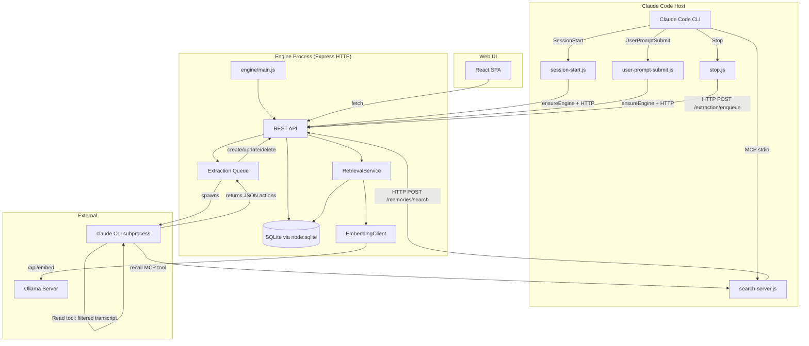
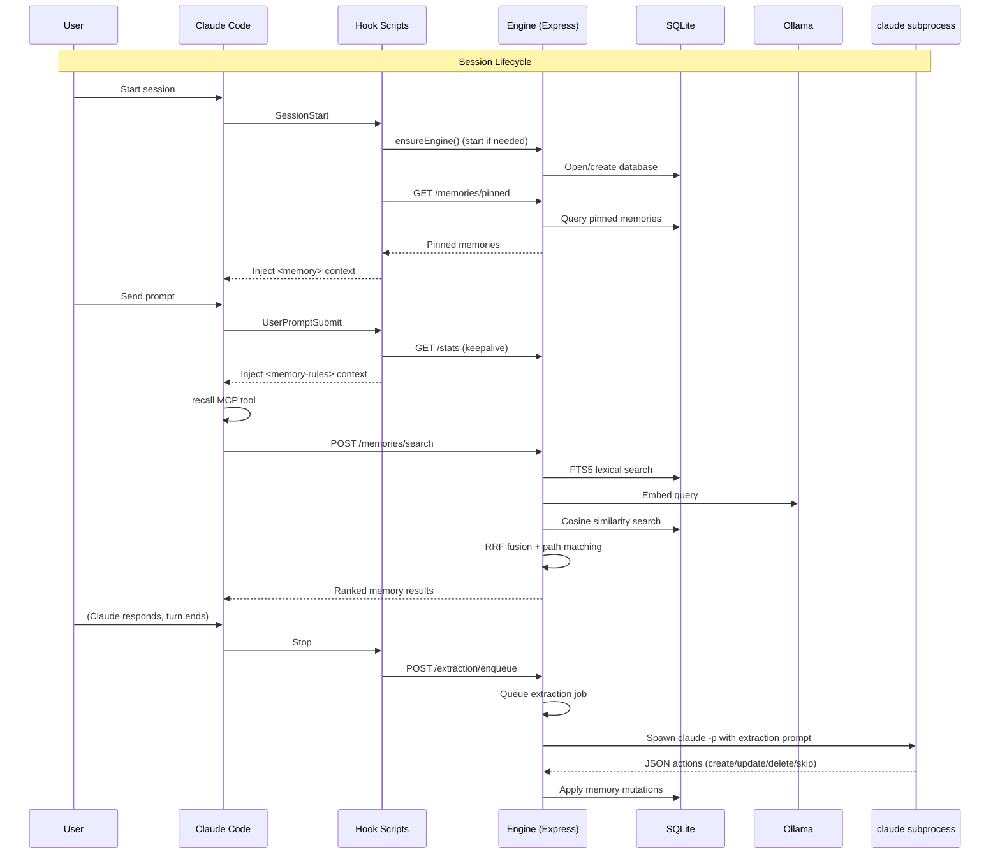

# Architecture Overview

The **memories** plugin is a Claude Code plugin that gives Claude persistent, project-scoped memory backed by SQLite. It operates through three integration surfaces: **hooks** (lifecycle events), an **MCP tool** (`recall`), and a **local HTTP engine** (Express).

## System Diagram



## Component Responsibilities

| Component | Role |
|---|---|
| **Hooks** (3 scripts) | Lifecycle integration with Claude Code. Bootstrap engine, inject context, trigger extraction. |
| **Engine** (`engine/main.ts`) | Long-running local HTTP server. Owns the SQLite database, manages idle timeout, coordinates extraction. |
| **API** (`api/app.ts`) | Express app with REST routes for CRUD, search, extraction queue, background hooks, logs, stats. |
| **Extraction** (`extraction/run.ts`) | Worker that filters transcript noise, builds a prompt with last 3 interactions, spawns agentic `claude` subprocess (with Read + recall tools), parses actions, applies them. |
| **MCP Server** (`mcp/search-server.ts`) | Stdio MCP server exposing the `recall` tool. Reads lockfile, calls engine `/memories/search`. |
| **Storage** (`storage/database.ts`) | `MemoryStore` class wrapping `node:sqlite` (DatabaseSync). Schema, CRUD, FTS, embeddings. |
| **Retrieval** (`retrieval/`) | Hybrid search: path matching + lexical FTS + semantic cosine similarity, merged via RRF. |
| **Web UI** (`web/src/`) | React + TanStack Query SPA served at `/ui`. Manages memories, views hooks, logs, stats. |
| **Shared** (`shared/`) | Constants, types, logger, lockfile, paths, filesystem utils, hook I/O protocol, markdown formatter, token budgeting. |

## Technology Stack

| Layer | Technology |
|---|---|
| Runtime | Node.js 24 (required for `node:sqlite`) |
| Language | TypeScript 5.9, ES2022 target, NodeNext modules |
| Database | SQLite via `node:sqlite` (built-in), optional `sqlite-vec` extension for vector search |
| HTTP Server | Express |
| Search | FTS5 (lexical), cosine similarity (semantic), picomatch (path), RRF fusion |
| Embeddings | Ollama (`bge-m3` 1024-dim default, `nomic-embed-text` 768-dim alt) |
| Extraction LLM | `claude-sonnet-4-6` via `claude` CLI subprocess |
| Build | tsup (backend), Vite (frontend) |
| Testing | Vitest |
| Frontend | React 19, TanStack Query, custom CSS |
| MCP | `@modelcontextprotocol/sdk` (stdio transport) |
| Validation | Zod throughout |
| IDs | ULID via `ulid` package |

## Data Flow Summary



## File Structure

```
claude-memory/
  package.json                    # Workspace root
  tsconfig.base.json             # Shared TS config
  eslint.config.mjs              # Linting
  .claude-plugin/
    marketplace.json             # Plugin marketplace metadata
  plugins/memories/
    package.json                 # Plugin package
    tsconfig.json                # Backend TS config
    tsup.config.ts               # Backend bundler config
    settings.json                # Plugin settings (token budget, search limits)
    hooks/
      hooks.json                 # Hook registrations (3 hooks)
    .claude-plugin/
      plugin.json                # Plugin manifest
    .mcp.json                    # MCP server declaration
    src/
      engine/                    # Engine bootstrap + node runtime discovery
      extraction/                # Transcript extraction worker
      hooks/                     # Hook handler scripts
      api/                       # Express app + routes
      mcp/                       # MCP recall server
      storage/                   # SQLite database layer
      retrieval/                 # Hybrid search pipeline
      shared/                    # Constants, types, utils
    web/
      src/                       # React frontend
      dist/                      # Built frontend (served at /ui)
      vite.config.ts             # Frontend bundler config
      tsconfig.json              # Frontend TS config
```

## Global Paths

All persistent state lives under `~/.claude/memories/`:

| Path | Purpose |
|---|---|
| `~/.claude/memories/memories.db` | SQLite database |
| `~/.claude/memories/engine.lock` | Engine lockfile (host, port, pid) |
| `~/.claude/memories/events.jsonl` | Event log (NDJSON) |
| `~/.claude/memories/startup.lock` | Startup coordination lock |
| `~/.claude/memories/engine-stderr.log` | Engine stderr capture |
