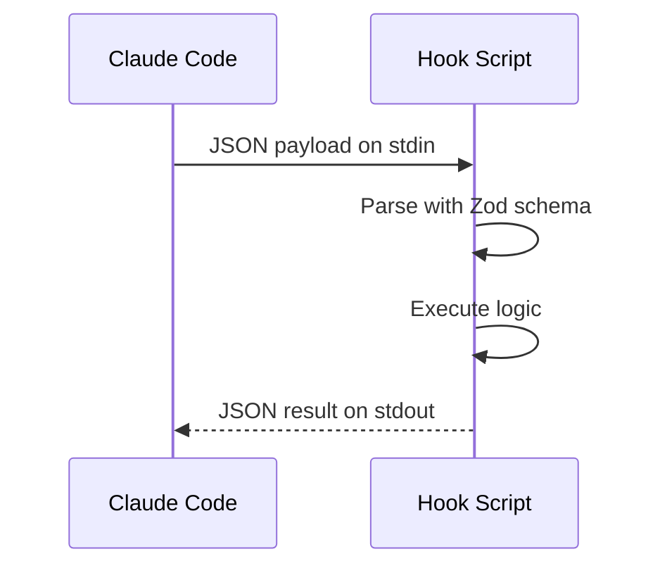
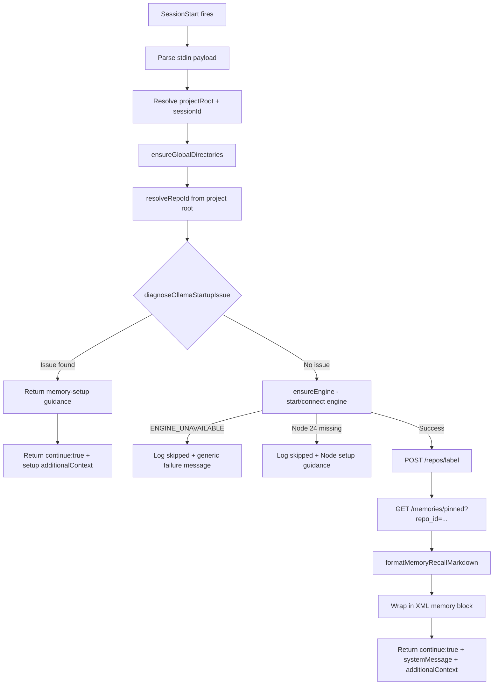
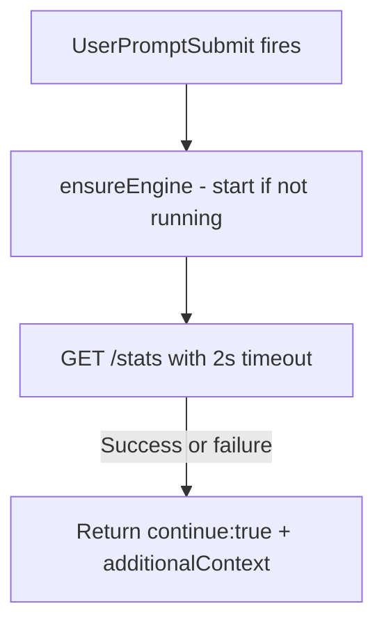
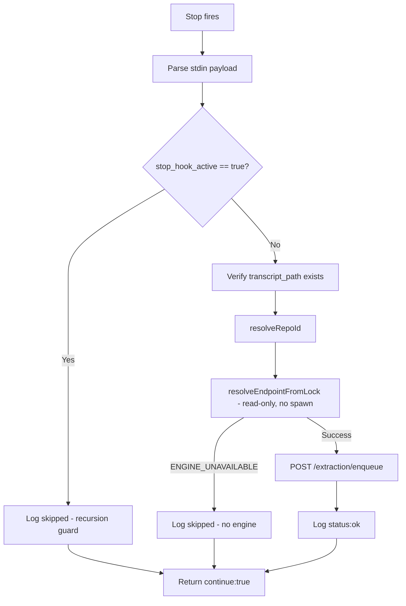

# Hook Flows

Three hooks integrate the plugin with Claude Code's lifecycle. All hooks are **fail-open** (`continue: true` always returned) and communicate via JSON on stdin/stdout.

## Hook Registration

Defined in `hooks/hooks.json`:

```json
{
  "hooks": [
    { "event": "SessionStart",      "command": "node \"${CLAUDE_PLUGIN_ROOT}/dist/hooks/session-start.js\"" },
    { "event": "UserPromptSubmit",   "command": "node \"${CLAUDE_PLUGIN_ROOT}/dist/hooks/user-prompt-submit.js\"" },
    { "event": "Stop",              "command": "node \"${CLAUDE_PLUGIN_ROOT}/dist/hooks/stop.js\"" }
  ]
}
```

All commands quote `${CLAUDE_PLUGIN_ROOT}` to support paths with spaces.

## Hook I/O Protocol



Output shape (`HookResult`):
```
{
  continue: boolean,              // always true (fail-open)
  systemMessage?: string,         // injected as system-level text
  hookSpecificOutput?: {
    hookEventName: string,
    additionalContext: string     // injected into conversation context
  }
}
```

---

## 1. SessionStart Hook

**When:** Claude starts a new session.

**Input schema:** `{ cwd?, source?, model?, agent_type?, project_root?, session_id? }`



**Ollama diagnosis substeps:**
1. Check `isOllamaInstalled()` via `execFile('ollama', ['--version'])`
2. Fetch `GET /api/tags` from Ollama (timeout capped at 2500ms)
3. Check if target embedding model is in the returned list
4. Return issue code: `not-installed`, `service-unavailable`, or `model-missing`

**On success, outputs:**
- `systemMessage`: `"Memory UI: http://{host}:{port}/ui"`
- `additionalContext`: `<memory>` XML block containing pinned memories + guidance

---

## 2. UserPromptSubmit Hook

**When:** Every time the user submits a prompt.

**Input schema:** `{ cwd?, project_root?, prompt?, session_id? }`



**Always outputs `additionalContext`** with `<memory-rules>` XML block (see [Prompts](./09-prompts-and-injected-text.md)).

The prompt payload is **not used** -- this hook only keeps the engine alive and injects the memory-rules reminder.

---

## 3. Stop Hook

**When:** Claude finishes a turn or session ends.

**Input schema:** `{ cwd?, project_root?, session_id?, transcript_path (required), last_assistant_message?, stop_hook_active? }`



**Key difference:** Stop uses `resolveEndpointFromLock()` (read-only, never spawns engine). If the engine isn't running, extraction is silently skipped.

**Extraction enqueue payload:**
```
{
  transcript_path: string,
  project_root: string,
  repo_id: string,
  last_assistant_message?: string,
  session_id?: string
}
```

---

## Hook-to-Engine Interaction Matrix

| Hook | Starts Engine? | Engine Calls | Extraction? |
|---|---|---|---|
| SessionStart | Yes (`ensureEngine`) | `POST /repos/label`, `GET /memories/pinned` | No |
| UserPromptSubmit | Yes (`ensureEngine`) | `GET /stats` (keepalive) | No |
| Stop | No (read-only lock) | `POST /extraction/enqueue` | Yes (triggers) |

---

## Error Handling Strategy

All hooks follow the same pattern:

```
try {
  // main logic
} catch (error) {
  if (isEngineUnavailableError(error)) {
    log status: 'skipped'
  } else {
    log status: 'error'
  }
  return { continue: true }  // always fail-open
}
```

The plugin never blocks Claude Code from proceeding, even on total failure.
