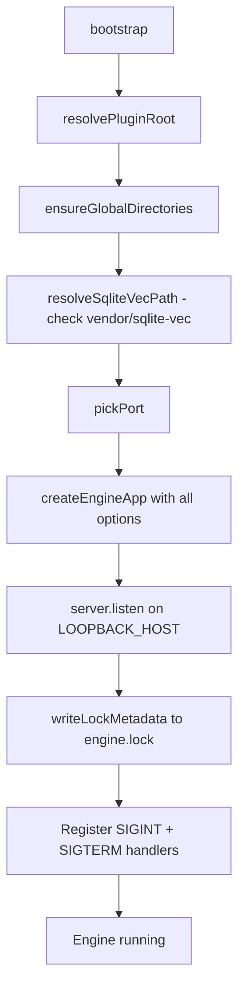
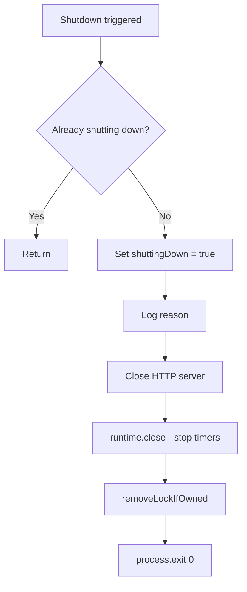
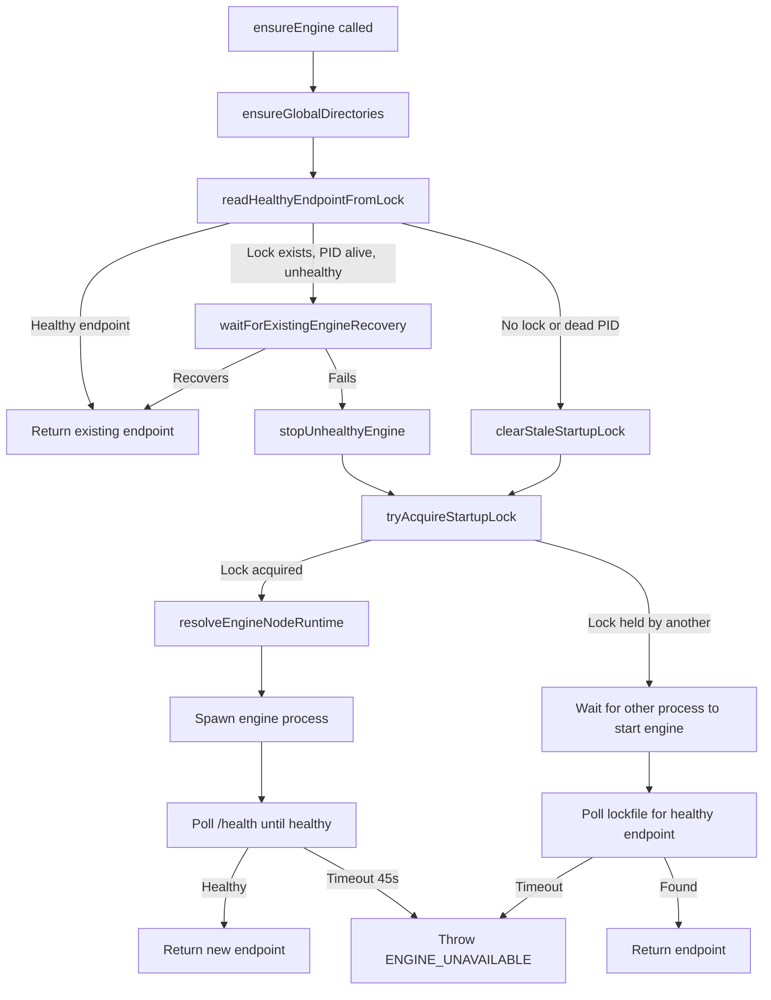
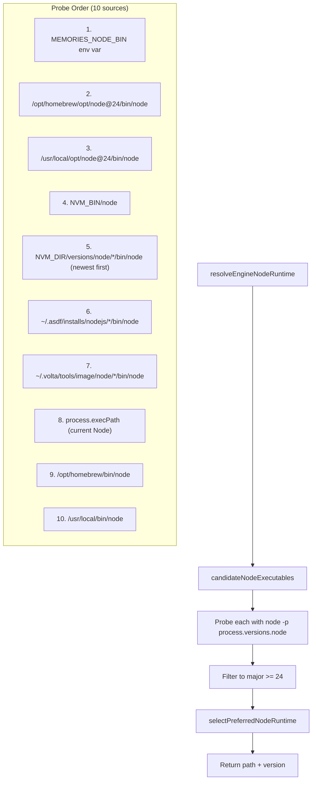
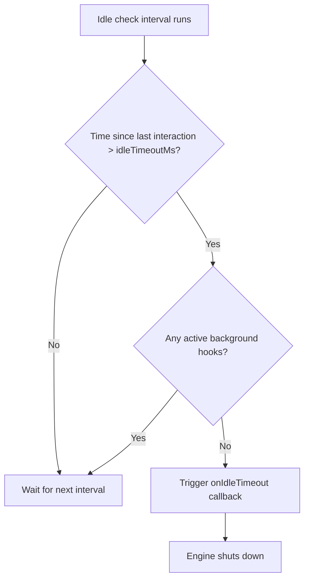
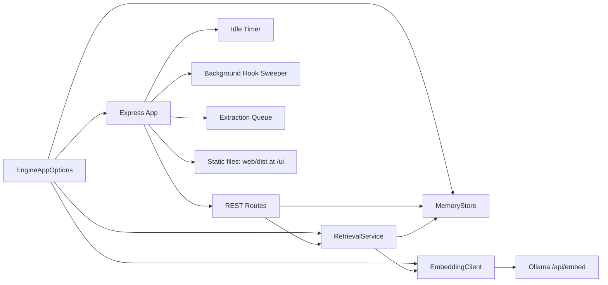

# Engine Lifecycle

The engine is a persistent local HTTP server (Express) that owns the SQLite database and coordinates all memory operations. It runs as a background process managed via a lockfile.

## Bootstrap Flow

Entry point: `engine/main.ts`



### Port Selection (`pickPort`)
1. Check `MEMORIES_ENGINE_PORT` env var
2. If not set, bind to port 0 and read the assigned ephemeral port
3. Close the temp server, return the port

### Shutdown Flow



Shutdown reasons: `idle-timeout`, `api-request`, `sigint`, `sigterm`

---

## Engine Startup Coordination (`ensureEngine`)

Called by SessionStart and UserPromptSubmit hooks. Handles concurrent startup races.



### Key Timing Constants

| Constant | Default | Purpose |
|---|---|---|
| `DEFAULT_BOOT_TIMEOUT_MS` | 45,000ms | Max wait for engine to become healthy |
| `DEFAULT_BOOT_POLL_MS` | 120ms | Interval between health polls |
| `DEFAULT_HEALTH_TIMEOUT_MS` | 1,000ms | Timeout for single health check |
| `DEFAULT_UNHEALTHY_ENGINE_GRACE_MS` | 2,000ms | Grace period before killing unhealthy engine |
| `DEFAULT_ENGINE_TERMINATION_TIMEOUT_MS` | 5,000ms | Max wait for engine PID to exit after SIGTERM |
| `STARTUP_LOCK_STALE_MULTIPLIER` | 2x boot timeout | When startup lock is considered stale |

### Startup Lock Protocol

The startup lock (`startup.lock`) prevents multiple hook invocations from spawning duplicate engines:

```
1. Try to create startup.lock with O_EXCL (atomic create-or-fail)
2. If acquired: you are the spawner, proceed to spawn engine
3. If not acquired: another process is spawning, wait for lockfile to appear
4. Stale lock detection: if lock file's PID is dead or lock is older than 2x boot timeout, remove it
```

---

## Node Runtime Discovery

The engine requires Node 24 for `node:sqlite`. Discovery probes multiple sources.



Selection priority: prefer exact major 24, fallback to highest available >= 24. Candidates are deduplicated by resolved path. Each probe runs `node -p process.versions.node` with a 1500ms timeout.

---

## Idle Timeout

The engine auto-shuts down after inactivity to avoid lingering processes.



| Constant | Default |
|---|---|
| `DEFAULT_IDLE_TIMEOUT_MS` | 300,000ms (5 min) |
| `DEFAULT_IDLE_CHECK_INTERVAL_MS` | 30,000ms (30 sec) |

Any API request resets `lastInteractionAtMs`. Active background hooks (extraction workers) block idle shutdown.

---

## Lockfile Format

Stored at `~/.claude/memories/engine.lock`:

```json
{
  "host": "127.0.0.1",
  "port": 54321,
  "pid": 12345,
  "started_at": "2026-03-20T10:00:00.000Z"
}
```

- `host` must be loopback (`127.0.0.1`, `::1`, or `localhost`) -- validated on read
- PID liveness checked via `kill(pid, 0)` signal
- Written atomically (write to temp file, rename)
- Removed on shutdown only if PID matches current process

---

## `createEngineApp` Wiring



`EngineAppOptions` fields:
- `pluginRoot`, `dbPath`, `lockPath`, `eventLogPath`, `port`
- `sqliteVecExtensionPath` (nullable)
- `onIdleTimeout`, `onShutdownRequest` (callbacks)
- `idleTimeoutMs`, `idleCheckIntervalMs`, `backgroundHookPolicy` (overrides)
