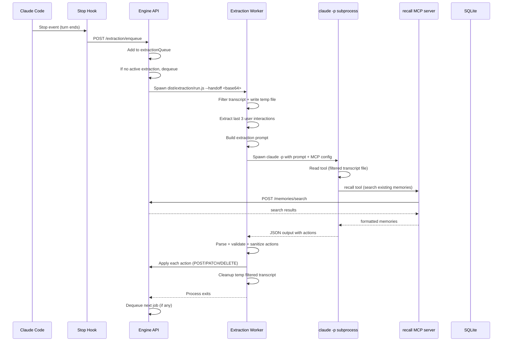
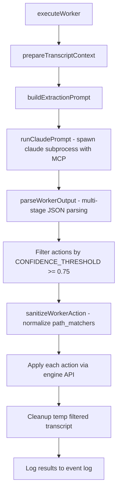

# Extraction Pipeline

The extraction pipeline reads a conversation transcript, identifies durable memories, and creates/updates/deletes them in the database. It runs as a background worker spawned by the engine.

## Trigger Flow



## Queue Management

The engine maintains an in-memory extraction queue:

```
extractionQueue: Array<EnqueuePayload>     // pending jobs
activeExtractionChild: ChildProcess | null  // current worker process
activeExtractionJob: EnqueuePayload | null  // current job metadata
```

- Only one extraction runs at a time
- When a worker exits, the next job is dequeued
- `GET /extraction/status` returns active job + queue contents

## Worker Lifecycle

Entry: `extraction/run.ts` → `runFromCli()` → `executeWorker(payload)`

### Handoff Payload

Passed via `--handoff <base64-encoded-json>`:

```
{
  endpoint: { host, port },     // engine HTTP address
  project_root: string,
  repo_id: string,
  transcript_path: string,
  last_assistant_message?: string,
  session_id?: string,
  background_hook_id?: string   // for heartbeat/finish tracking
}
```

### Worker Steps



### Transcript Filtering (`prepareTranscriptContext`)

The raw Claude Code transcript (JSONL) is heavily filtered before extraction. In typical sessions, ~93% of transcript bytes are noise (`progress` events, tool results, thinking blocks).

**Filtering rules:**

| Line type | Action |
|---|---|
| `progress` | Drop entirely |
| `file-history-snapshot` | Drop entirely |
| `system` | Drop entirely |
| `isSidechain: true` (subagent) | Drop entirely |
| `assistant/thinking` blocks | Drop (strip from content array) |
| `tool_result` content | Truncate to 200 chars |
| `tool_use` blocks | Keep only `name` and `id`, drop `input` |
| `user` text messages | Keep in full |
| `assistant` text blocks | Keep in full |

**Path extraction:** The last 300 raw (pre-filter) lines are still walked for `relatedPaths` via `collectPathValues()` — this is local-only work with zero API cost, capped at 80 paths.

**Last 3 interactions:** After filtering, the function scans backwards to find the 3rd-to-last user text message and slices from there to the end. This becomes the initial context passed inline in the prompt.

**Output:**
- Filtered transcript written to `{project_root}/.claude-memory/transcript-filtered-{sessionId}.jsonl`
- Returns `{ filteredTranscriptPath, last3Interactions, relatedPaths }`

### Agentic Extraction (Tools)

Instead of pre-fetching candidate memories, the extraction Claude has two tools:

1. **Read tool** (built into Claude CLI) — reads the filtered transcript file for earlier conversation context beyond the last 3 interactions
2. **recall MCP tool** (existing `dist/mcp/search-server.js`) — searches project memories to check for duplicates before creating, and to find memory IDs for update/delete

### Claude Subprocess

```
claude -p \
  --output-format json \
  --no-session-persistence \
  --model claude-sonnet-4-6 \
  --mcp-config '{"memories":{"type":"stdio","command":"node","args":["<pluginRoot>/dist/mcp/search-server.js"]}}' \
  --allowedTools Read mcp__memories__recall
```

- Prompt fed via stdin with last 3 interactions inline
- `cwd` set to `projectRoot`
- Extraction Claude decides when to use Read/recall tools
- Stdout collected as JSON response

### Output Parsing (`parseWorkerOutput`)

Multi-stage fallback:

```mermaid
flowchart TD
    RAW[Raw stdout] --> STAGE1{Direct JSON.parse?}
    STAGE1 -->|Valid JSON| CHECK1{Has actions array?}
    CHECK1 -->|Yes| VALIDATE[Validate with workerOutputSchema]
    CHECK1 -->|No| STAGE2

    STAGE1 -->|Parse error| STAGE2{Extract from .result field?}
    STAGE2 -->|Found| PARSE_TEXT1[parseWorkerOutputFromText]
    STAGE2 -->|Not found| STAGE3{Extract from .content[].text?}

    STAGE3 -->|Found| PARSE_TEXT2[parseWorkerOutputFromText]
    STAGE3 -->|Not found| FAIL[Throw ExtractionParseError]

    PARSE_TEXT1 --> VALIDATE
    PARSE_TEXT2 --> VALIDATE
```

`parseWorkerOutputFromText`:

1. Try direct JSON.parse → check for `actions` array
2. Extract fenced `` ```json...``` `` block → JSON.parse

### Action Contracts

Four action types, discriminated by `action` field:

```
CREATE:
  action: "create"
  confidence: 0..1
  reason?: string
  memory_type: "fact" | "rule" | "decision" | "episode"
  content: string
  tags: string[]           (default [])
  is_pinned: boolean       (default false)
  path_matchers: [{path_matcher: string}]  (default [])

UPDATE:
  action: "update"
  confidence: 0..1
  reason?: string
  memory_id: string
  updates: { content?, tags?, is_pinned?, path_matchers? }  (at least one required)

DELETE:
  action: "delete"
  confidence: 0..1
  reason?: string
  memory_id: string

SKIP:
  action: "skip"
  confidence: 0..1         (default 1)
  reason?: string
```

### Confidence Filtering

`CONFIDENCE_THRESHOLD = 0.75`

Actions with confidence < 0.75 are silently dropped.

### Path Matcher Sanitization (`sanitizePathMatchers`)

Applied to create/update actions:

1. Reject wildcard-only patterns: `*`, `**`, `**/*`, `/`, `./`
2. If a bare basename matches a known related path, expand to the full relative path
3. Deduplicate
4. Cap at 12 matchers per memory

### Action Application

Each action maps to an engine API call:

| Action   | HTTP Call                                                                              |
| -------- | -------------------------------------------------------------------------------------- |
| `create` | `POST /memories/add { repo_id, memory_type, content, tags, is_pinned, path_matchers }` |
| `update` | `PATCH /memories/{id} { repo_id, ...updates }`                                         |
| `delete` | `DELETE /memories/{id}?repo_id=...`                                                    |
| `skip`   | No-op (logged only)                                                                    |

**Stop on first failure:** If any write action fails (non-ok response), remaining actions are skipped and the failure is logged.

### Background Hook Integration

If `background_hook_id` is present in the payload:

- Worker sends periodic heartbeats to `POST /background-hooks/{id}/heartbeat`
- On completion, sends `POST /background-hooks/{id}/finish` with status

### Event Logging

All extraction events are appended to `~/.claude/memories/events.jsonl`:

- `extraction/start` — worker began
- `extraction/context` — transcript prepared, paths extracted
- `extraction/claude-response` — Claude subprocess completed
- `extraction/parse` — output parsed (ok or error)
- `extraction/skip` — skipped action (low confidence or skip type)
- `extraction/apply` — action applied (ok or error)
- `extraction/error` — unrecoverable error
- `extraction/complete` — worker finished
