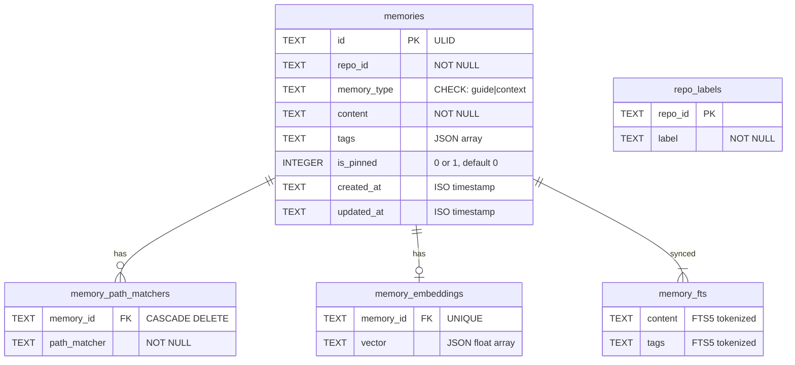
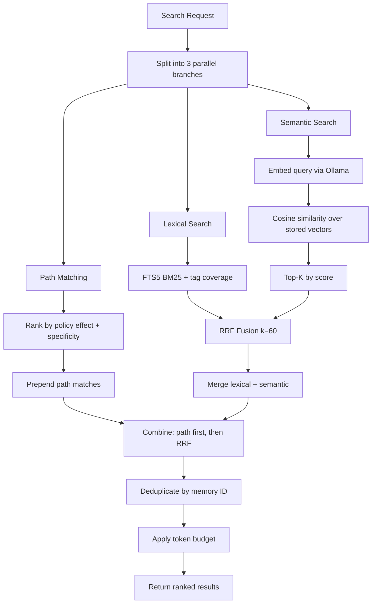
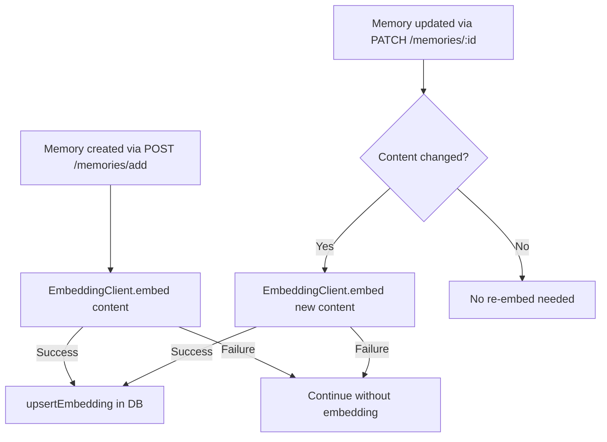

# Storage & Retrieval

## SQLite Database

Uses `node:sqlite` (`DatabaseSync`) -- Node 24's built-in synchronous SQLite driver.

Located at: `~/.claude/memories/memories.db`

### Schema



### Optional: sqlite-vec Extension

If `vendor/sqlite-vec/darwin-{arch}/vec0.dylib` exists:
- Creates `vec_memory` virtual table for native vector similarity
- Falls back to JSON-based cosine similarity if not available

### Memory Types

| Type | Purpose |
|---|---|
| `fact` | Structural facts -- file locations, exports, types, API shapes |
| `rule` | General principles, preferences, constraints, "how we do X" |
| `decision` | Architectural choices, trade-offs, "why we chose X" |
| `episode` | Specific events, workflow steps, contextual details |

### MemoryStore Methods

| Method | SQL Operation |
|---|---|
| `createMemory(input)` | INSERT into memories + memory_fts + memory_path_matchers (transaction) |
| `updateMemory(id, repoId, updates)` | UPDATE memories + sync FTS + replace path_matchers (transaction) |
| `deleteMemory(id, repoId)` | DELETE from memories (cascades to matchers, embeddings) |
| `listMemories(repoId, limit, offset)` | SELECT with pagination |
| `getMemoriesByIds(ids)` | SELECT WHERE id IN (...) |
| `getPinnedMemories(repoId)` | SELECT WHERE is_pinned = 1 |
| `lexicalSearch(repoId, query, limit)` | FTS5 MATCH with BM25 + tag coverage scoring |
| `upsertEmbedding(memoryId, vector)` | INSERT OR REPLACE into memory_embeddings |
| `listEmbeddings(repoId)` | JOIN memories + memory_embeddings |
| `listPathMatchers(repoId)` | JOIN memories + memory_path_matchers |
| `listRepos()` | SELECT DISTINCT repo_id + LEFT JOIN repo_labels |
| `upsertRepoLabel(repoId, label)` | INSERT OR REPLACE into repo_labels |
| `totalMemories(repoId)` | COUNT(*) |
| `close()` | Close database connection |

All mutating operations use explicit `BEGIN`/`COMMIT`/`ROLLBACK` transactions.

---

## Hybrid Retrieval Pipeline

The `RetrievalService` combines three search strategies and merges via RRF.



### Path Matching

Uses `picomatch` for glob matching against `targetPaths` from the search request.

**Ranking priority:**

1. **Policy effect** (from memory content/tags):
   - `deny` — prohibitive rules (highest priority)
   - `must` — mandatory rules
   - `preference` — preferences
   - `context` — everything else (lowest)

2. **Matcher specificity** (from pattern shape):
   - `exact-file` — e.g., `src/api/app.ts`
   - `exact-dir` — e.g., `src/api/`
   - `single-glob` — e.g., `src/*.ts`
   - `deep-glob` — e.g., `src/**/*.ts`

### Lexical Search

FTS5 full-text search on `content` + `tags` columns:
- BM25 scoring from SQLite FTS5
- Tag coverage bonus: fraction of query terms found in tags
- Blended score = BM25 + tag_coverage_weight

### Semantic Search

1. Embed query text via Ollama (`/api/embed` endpoint)
2. Load all stored embeddings for the repo
3. Compute cosine similarity between query vector and each stored vector
4. Return top-K by similarity score

### RRF Fusion (Reciprocal Rank Fusion)

Merges lexical and semantic ranked lists:

```
RRF_score(doc) = sum over lists: 1 / (k + rank_in_list)
where k = 60
```

Each document gets an RRF score from its rank in each list. Documents appearing in both lists get scores summed.

### Token Budget

Applied as the final step. Configured via `settings.json`:

```json
{ "maxHookInjectionTokens": 6000 }
```

- Token estimation: `text.length / 4`
- Greedy packing: always include first result, then add results until budget exhausted
- Ensures recall output fits within Claude's context injection limits

---

## Embedding System

### EmbeddingClient

HTTP client for Ollama's `/api/embed` endpoint.

**Configuration:**

| Source | Default |
|---|---|
| `MEMORIES_OLLAMA_URL` env | `http://127.0.0.1:11434` |
| `MEMORIES_OLLAMA_PROFILE` env | `bge` |
| `MEMORIES_OLLAMA_TIMEOUT_MS` env | (per-profile default) |

**Ollama Profiles:**

| Profile | Model | Dimensions |
|---|---|---|
| `bge` (default) | `bge-m3` | 1024 |
| `nomic` | `nomic-embed-text` | 768 |

**Failure handling:**
- 15-second backoff after failed embed call
- Validates returned vector dimension count against profile config
- Handles both `embedding` and `embeddings[0]` response shapes from Ollama

### Embedding Lifecycle



Embedding is best-effort -- failures don't block memory creation/updates. Memories without embeddings simply won't appear in semantic search results.

---

## Search Request/Response Shapes

### Request (`POST /memories/search`)

```
{
  repo_id: string,
  query: string,
  limit?: number,                    // default 10, max 100
  include_pinned?: boolean,          // default true
  target_paths?: string[],           // for path matching
  memory_types?: ("guide"|"context")[]
}
```

### Response

```
{
  meta: {
    query: string,
    returned: number,
    duration_ms: number,
    source: "hybrid" | "lexical" | "path"
  },
  results: [{
    id: string,
    memory_type: string,
    content: string,
    tags: string[],
    is_pinned: boolean,
    path_matchers: string[],
    score: number,
    source: "hybrid" | "lexical" | "semantic" | "path",
    matched_by?: ("path"|"lexical"|"semantic")[],
    path_score?: number,
    lexical_score?: number,
    semantic_score?: number,
    rrf_score?: number,
    updated_at: string
  }]
}
```
