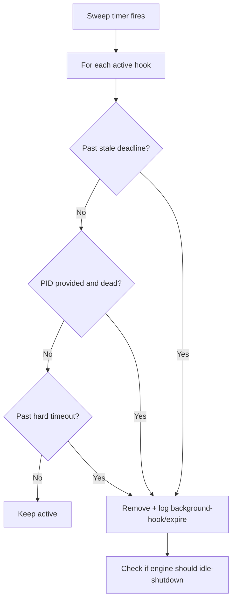

# API Reference

All routes are served by the Express engine on `127.0.0.1:{port}`. The engine is not exposed externally.

## Health & System

### `GET /health`

Returns engine health status.

**Response:** `{ ok: true, port: number }`

### `GET /stats`

Returns engine statistics. Also acts as keepalive (resets idle timer).

**Response:**
```
{
  active_background_hooks: number,
  online: true,
  uptime_ms: number,
  last_interaction_at: string,     // ISO timestamp
  idle_timeout_ms: number,
  idle_remaining_ms: number
}
```

### `POST /shutdown`

Triggers graceful engine shutdown. Calls `onShutdownRequest` callback.

**Response:** `{ status: "shutting_down" }`

---

## Repository Management

### `GET /repos`

Lists all known repositories.

**Response:** `{ repos: [{ repo_id, label }] }`

### `POST /repos/label`

Registers or updates a repository label.

**Body:** `{ repo_id: string, label: string }`

**Response:** `{ repo_id, label }`

---

## Memory CRUD

### `POST /memories/add`

Creates a new memory.

**Body:**
```
{
  repo_id: string,
  memory_type: "guide" | "context",
  content: string,
  tags?: string[],
  is_pinned?: boolean,
  path_matchers?: [{ path_matcher: string }]
}
```

**Side effects:**
- Generates ULID for ID
- Attempts to embed content via Ollama (best-effort)
- Logs `memory/create` event

**Response:** `{ memory: MemoryRecord }`

### `GET /memories`

Lists memories for a repo with pagination.

**Query params:** `repo_id` (required), `limit` (1-200, default 50), `offset` (default 0)

**Response:** `{ items: MemoryRecord[], total: number }`

### `PATCH /memories/:id`

Updates an existing memory.

**Body:**
```
{
  repo_id: string,
  content?: string,
  tags?: string[],
  is_pinned?: boolean,
  path_matchers?: [{ path_matcher: string }]
}
```

**Side effects:**
- Re-embeds if content changed (best-effort)
- Logs `memory/update` event

**Response:** `{ memory: MemoryRecord }`

### `DELETE /memories/:id`

Deletes a memory.

**Query params:** `repo_id` (required)

**Side effects:**
- Cascades to path_matchers and embeddings
- Logs `memory/delete` event

**Response:** `{ deleted: true, id: string }`

---

## Search

### `POST /memories/search`

Hybrid search across memories.

**Body:**
```
{
  repo_id: string,
  query: string,
  limit?: number,            // default 10, max 100
  include_pinned?: boolean,  // default true
  target_paths?: string[],
  memory_types?: string[]
}
```

**Pipeline:** Path matching + Lexical FTS + Semantic cosine → RRF fusion → Token budget

**Side effects:** Logs `memory/search` event

**Response:** See [Storage & Retrieval](./05-storage-and-retrieval.md#search-requestresponse-shapes)

### `GET /memories/pinned`

Returns all pinned memories for a repo.

**Query params:** `repo_id` (required)

**Response:** `{ items: MemoryRecord[] }`

---

## Extraction

### `POST /extraction/enqueue`

Enqueues a transcript for memory extraction.

**Body:**
```
{
  transcript_path: string,
  project_root: string,
  repo_id: string,
  session_id?: string,
  last_assistant_message?: string
}
```

**Behavior:**
- Adds to in-memory queue
- If no active extraction, immediately spawns worker
- Worker is `dist/extraction/run.js --handoff <base64>`

**Response:** `{ queued: true }` or `{ started: true }`

### `GET /extraction/status`

Returns current extraction state.

**Response:**
```
{
  active: { repo_id, transcript_path, session_id? } | null,
  queue: [{ repo_id, transcript_path, session_id? }]
}
```

---

## Background Hooks

Track long-running background operations (mainly extraction workers).

### `GET /background-hooks`

Lists active background hooks.

**Response:**
```
{
  items: [{
    id, hook_name, session_id?, detail?, pid?,
    started_at, last_heartbeat_at, stale_at, hard_timeout_at
  }],
  meta: { active: number, now: string }
}
```

### `POST /background-hooks/start`

Registers a new background hook.

**Body:** `{ id, hook_name, session_id?, detail?, pid? }`

**Response:** `{ id, started: true }`

### `POST /background-hooks/:id/heartbeat`

Renews a hook's stale deadline.

**Body:** `{ detail?, pid? }`

**Response:** `{ id, renewed: true }`

### `POST /background-hooks/:id/finish`

Marks a hook as complete.

**Body:** `{ status: "ok"|"error"|"skipped", detail?, pid? }`

**Side effects:** Removes hook from active tracking. May trigger idle check.

**Response:** `{ id, finished: true }`

---

## Logs

### `GET /logs`

Returns event log entries.

**Query params:** `limit` (1-1000, default 200), `order` (`asc`|`desc`, default `desc`)

**Response:** `{ items: EventLog[] }`

---

## Static Files

### `GET /ui/*`

Serves the React SPA from `web/dist/`. Base path: `/ui/`.

---

## Error Format

All errors follow:

```json
{
  "error": {
    "code": "ERROR_CODE",
    "message": "Human-readable description"
  }
}
```

Common error codes:
- `VALIDATION_ERROR` — Zod schema validation failure
- `NOT_FOUND` — Memory or hook ID not found
- `INTERNAL_ERROR` — Unexpected server error

---

## Background Hook Sweep

A periodic sweeper runs every `sweepIntervalMs` (default 30s):


