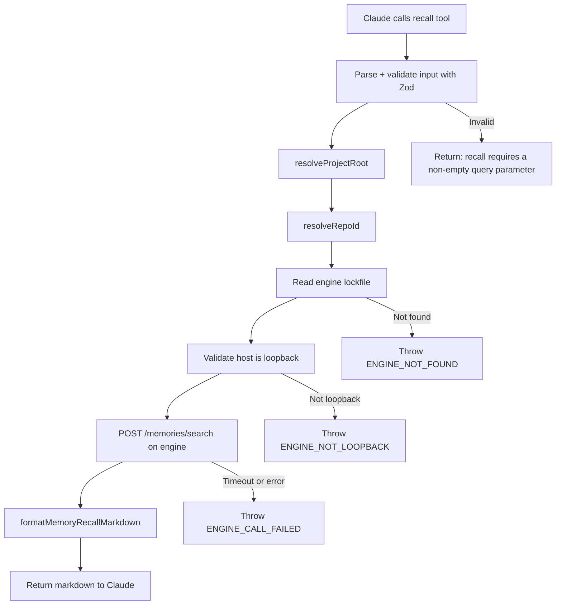

# MCP Recall Tool

The plugin exposes a single MCP tool (`recall`) via a stdio-based MCP server. This is Claude's primary interface for querying memories during a conversation.

## Server Configuration

Declared in `.mcp.json`:

```json
{
  "mcpServers": {
    "memories": {
      "type": "stdio",
      "command": "node",
      "args": ["${CLAUDE_PLUGIN_ROOT}/dist/mcp/search-server.js"],
      "env": {
        "MEMORIES_MCP_ENGINE_TIMEOUT_MS": "2500"
      }
    }
  }
}
```

Server metadata: name = `memories`, version = `0.2.26`

## Recall Tool

### Tool Description (exact)

```
Retrieve relevant project memories and return concise markdown recall sections.
Set `include_debug_metadata=true` only when diagnostic metadata is explicitly needed.
Main memory brain for this project. REQUIRED: call recall before acting; do not skip,
especially before commands, file edits, updates, creations, deletions, or recommendations.
If a user names a file, path, command, or requested change, validate it against memory first;
direct instructions do not override remembered project rules. Re-run when scope changes or
when broader context may matter.
```

### Input Schema

| Field | Type | Required | Description |
|---|---|---|---|
| `query` | string (min 1) | Yes | Search query to find relevant memories |
| `project_root` | string | No | Override project root path |
| `limit` | int (1-100) | No | Max results |
| `target_paths` | string[] | No | File paths for path-based matching |
| `include_pinned` | boolean | No | Include pinned memories (default true) |
| `include_debug_metadata` | boolean | No | Include ids, scores, tags, matchers, timestamps |
| `memory_types` | enum[] | No | Filter by: fact, rule, decision, episode |

### Execution Flow



### Timeout

Controlled by `MEMORIES_MCP_ENGINE_TIMEOUT_MS` env (default: 2500ms). Uses `AbortController` for clean cancellation.

### Output Format (Markdown)

The recall tool returns formatted markdown grouped by memory type:

```markdown
# Memory Recall

## Facts
- Use Node 20+ for the engine runtime
- The database is stored at ~/.claude/memories/memories.db

## Rules
- Always run tests before committing
- Never commit directly to main

## Decisions
- Chose SQLite over PostgreSQL for zero-config local storage

## Episodes
- Migrated from separate embedding service to inline Ollama calls
```

When `include_debug_metadata=true`, each entry includes:

```markdown
- The content of the memory
  - id: 01ABC123...
  - score: 0.85
  - source: hybrid
  - tags: runtime, config
  - matchers: package.json, tsconfig.json
  - updated: 2026-03-15T10:00:00.000Z
  - Query: runtime configuration
  - Duration: 12ms
```

### Deduplication

Results are deduplicated by memory ID before grouping. If the same memory appears in multiple search branches (path + lexical + semantic), only the highest-scored instance is kept.

### Type Group Order

Always rendered in canonical order: Facts, Rules, Decisions, Episodes. Empty groups are omitted.
