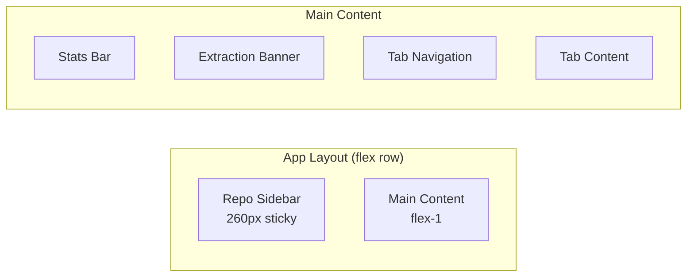
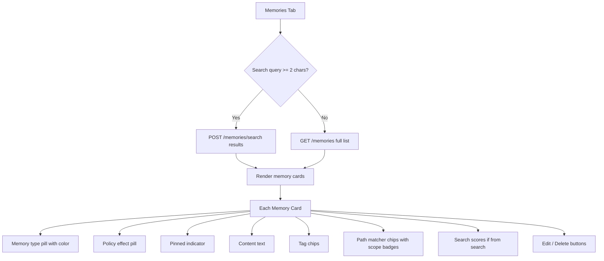
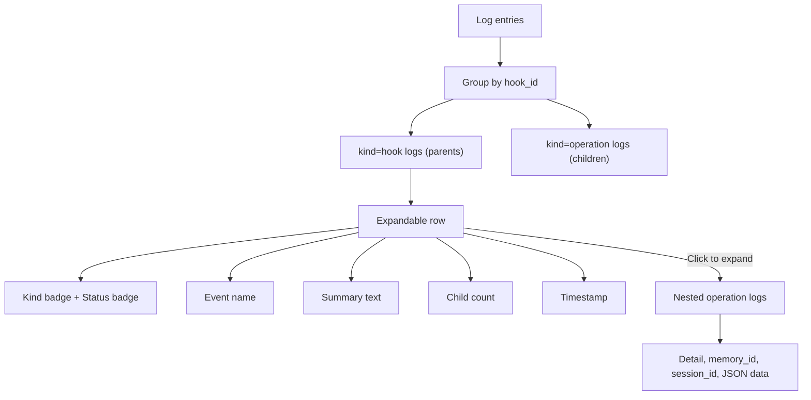

# Web UI

A React single-page application served by the engine at `/ui`. Provides a visual dashboard for managing memories, monitoring hooks, and viewing logs.

## Tech Stack

- React 19 with TanStack Query (react-query)
- Custom dark-theme CSS (no component library)
- Vite bundler, base path `/ui/`
- No routing library -- tab-based navigation

## Layout

## Components

### App (root component)

State management:
- `activeTab`: `'memories' | 'hooks' | 'logs'`
- `searchInput` / `searchQuery` (debounced 280ms)
- `selectedRepoId` / `repoFilter`
- `creating` / `editing` (modal state)
- `expandedLogs` (Set of log IDs)
- `shuttingDown` (shutdown button state)

### Data Queries

| Query | Endpoint | Polling | Condition |
|---|---|---|---|
| `reposQuery` | `GET /repos` | 10s | Always |
| `statsQuery` | `GET /stats` | 2s | Always |
| `extractionStatusQuery` | `GET /extraction/status` | 2s | Always |
| `backgroundHooksQuery` | `GET /background-hooks` | 1s | Hooks tab active |
| `memoriesQuery` | `GET /memories?repo_id=...` | 2s | Memories tab, no search |
| `searchResultsQuery` | `POST /memories/search` | 2s | Memories tab, query >= 2 chars |
| `logsQuery` | `GET /logs?limit=300` | 1s | Logs tab active |

### Mutations

| Mutation | API Call | Invalidates |
|---|---|---|
| `createMutation` | `POST /memories/add` | memories, stats, logs |
| `updateMutation` | `PATCH /memories/:id` | memories, stats, logs |
| `deleteMutation` | `DELETE /memories/:id` | memories, stats, logs |

### MemoryModal

Create/edit form with fields:
- `memory_type` select (fact / rule / decision / episode)
- `content` textarea
- `tags` text input (comma-separated)
- `path_matchers` textarea (newline-separated)
- `is_pinned` toggle switch

## Tabs

### Memories Tab

**Policy effect classification** (regex on content + tags):
- `deny` -- prohibitive rules (red)
- `must` -- mandatory rules (green)
- `preference` -- preferences (purple)
- `context` -- everything else (blue-gray)

**Matcher scope badges:**
- `exact-file` -- e.g., `src/api/app.ts` (teal)
- `exact-dir` -- e.g., `src/api/` (blue)
- `single-glob` -- e.g., `src/*.ts` (amber)
- `deep-glob` -- e.g., `src/**/*.ts` (red)

### Hooks Tab

Displays active background hooks with:
- Hook name and running duration
- Heartbeat age
- Stale/timeout countdowns
- ID, session ID, PID
- Detail text

### Logs Tab

Grouping logic: operation logs with a `data.hook_id` are grouped under their parent hook log.

## Stats Bar

Displays:
- Active background hooks count
- Engine uptime
- Idle remaining time
- Online status indicator (green dot)
- **Shutdown button** -- triggers `POST /shutdown`

## Extraction Banner

Visible when extraction is active or queued for the selected repo:
- `extracting` state -- green-tinted with pulse animation
- `queued` state -- amber-tinted

## Design System

Dark theme with `#0f1320` background, `#dce2f0` text.

Memory type colors:
- fact = blue (`#5f89ff`)
- rule = amber (`#d09d3d`)
- decision = green (`#66b88f`)
- episode = purple (`#ad7df0`)

Applied as left-border color on memory cards and as pill background.
