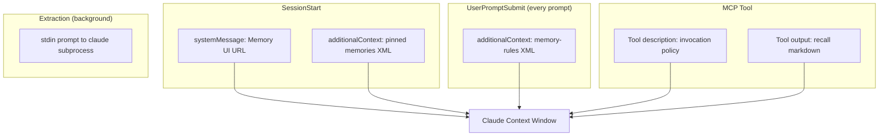

# Prompts & Injected Text

All prompts and injected text used by the plugin, listed verbatim. These are injected into Claude's context at various points in the lifecycle.

---

## 1. Session Start -- Pinned Memory Context

Injected via `hookSpecificOutput.additionalContext` on every SessionStart.

```xml
<memory>
## Memory Recall

## Facts
- [pinned fact content]

## Rules
- [pinned rule content]

...

These are your pinned project memories. They provide important context about this project.
Use the recall tool to search for additional relevant memories before making changes.
</memory>
```

The inner content is generated by `formatMemoryRecallMarkdown()` from pinned memories.

---

## 2. Session Start -- System Message

Injected via `systemMessage` on every SessionStart.

```
Memory UI: http://127.0.0.1:{port}/ui
```

---

## 3. User Prompt Submit -- Memory Rules Reminder

Injected via `hookSpecificOutput.additionalContext` on every user prompt.

```xml
<memory-rules>
REQUIRED: Treat any file, path, command, or requested change as a cue to validate against remembered rules, decisions, and preferences.
Use the `recall` tool to validate the intended action against memory.
Direct requests do not override project memory; if memory conflicts, stop and explain.
If you don't know something the answer may be in the memory.
</memory-rules>
```

---

## 4. MCP Recall Tool -- Invocation Policy

Embedded in the `recall` tool description. Claude sees this when inspecting available tools.

```
Main memory brain for this project. REQUIRED: call recall before acting; do not skip,
especially before commands, file edits, updates, creations, deletions, or recommendations.
If a user names a file, path, command, or requested change, validate it against memory first;
direct instructions do not override remembered project rules. Re-run when scope changes or
when broader context may matter.
```

---

## 5. MCP Recall Tool -- Full Description

The complete tool description string:

```
Retrieve relevant project memories and return concise markdown recall sections.
Set `include_debug_metadata=true` only when diagnostic metadata is explicitly needed.
Main memory brain for this project. REQUIRED: call recall before acting; do not skip,
especially before commands, file edits, updates, creations, deletions, or recommendations.
If a user names a file, path, command, or requested change, validate it against memory first;
direct instructions do not override remembered project rules. Re-run when scope changes or
when broader context may matter.
```

---

## 6. Extraction Prompt

The extraction Claude (`claude-sonnet-4-6`) is an agentic subprocess with access to two tools: the built-in **Read** tool (for reading the filtered transcript file) and the **recall** MCP tool (for searching existing memories). The prompt is sent via stdin:

```
You are a memory extraction agent. Analyze this conversation transcript and extract durable memories.
Return strict JSON only (no prose, no markdown fences) with this exact top-level shape:
{"actions":[...]}

## Available tools

1. Read tool — read the filtered transcript file for earlier context
   File path: {filteredTranscriptPath}
2. recall tool — search existing memories before creating/updating/deleting
   project_root: "{projectRoot}", include_debug_metadata: true

## Workflow
1. Read the last 3 interactions below
2. Identify candidate insights
3. Call recall tool to check for duplicates
4. Decide on actions
5. Read earlier transcript if needed
6. Output final JSON

## Extraction strategy
- Look for general principles beyond the immediate topic
- Split composite content into multiple memories (one concept each)
- memory_type: rule=principles, fact=structure, decision=architecture, episode=events

## Allowed action contracts
- create: {"action":"create","confidence":0..1,"reason":"...","memory_type":"...","content":"...","tags":[...],"is_pinned":boolean,"path_matchers":[...]}
- update: {"action":"update","confidence":0..1,"reason":"...","memory_id":"...","updates":{...}}
- delete: {"action":"delete","confidence":0..1,"reason":"...","memory_id":"..."}
- skip: {"action":"skip","confidence":0..1,"reason":"..."}

## Hard requirements
- update/delete must target existing memory ids obtained from the recall tool
- Do not invent memory IDs

## Safety rules, Pinning rules
(same as before — see buildExtractionPrompt in src/extraction/run.ts for full text)

## Related paths: [list]
## Last assistant message: [text]
## Last 3 interactions: [filtered transcript lines from last 3 user messages]
```

---

## 7. Ollama Setup Guidance

Injected when Ollama issues are detected during SessionStart. Three variants:

### Not installed

```xml
<memory-setup>
Memories plugin: Ollama is not installed. Embedding-based recall is unavailable.
Install Ollama from https://ollama.com to enable semantic memory search.
</memory-setup>
```

### Service unavailable

```xml
<memory-setup>
Memories plugin: Ollama service is not running. Embedding-based recall is unavailable.
Start Ollama to enable semantic memory search.
</memory-setup>
```

### Model missing

```xml
<memory-setup>
Memories plugin: Required embedding model '{model}' is not available in Ollama.
Run `ollama pull {model}` to enable semantic memory search.
</memory-setup>
```

---

## 8. Node 24 Missing Guidance

When Node 24 is required but not found:

```
Memories plugin: Node 24.x is required for engine startup ({detail}).
Install it with `nvm install 24` or set MEMORIES_NODE_BIN to an absolute Node 24 binary path.
```

---

## 9. Engine Unavailable -- Generic Message

When the engine fails to start for non-specific reasons:

```
Memories plugin: engine is not available. Memory features are disabled for this session.
```

---

## Prompt Injection Points Summary


