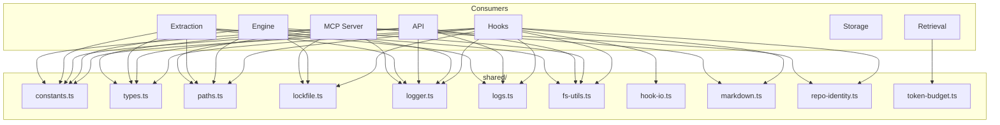

# Shared Utilities

All shared modules live in `src/shared/`. They are imported across hooks, engine, extraction, MCP, and API layers.

## Module Map



---

## constants.ts

All named constants and configuration values.

### Memory Types
- `MEMORY_TYPES = ['guide', 'context']`

### File Names
- `MEMORY_DB_FILE = 'memories.db'`
- Lock file, event log file, startup lock, stderr log names

### Networking
- `LOOPBACK_HOST = '127.0.0.1'`

### Search Defaults
- `DEFAULT_SEARCH_LIMIT = 10`
- `MAX_SEARCH_LIMIT = 100`
- `DEFAULT_SEMANTIC_K = 30` (from settings.json: `semanticK`)
- `DEFAULT_LEXICAL_K = 30` (from settings.json: `lexicalK`)

### Timeouts
- `DEFAULT_IDLE_TIMEOUT_MS = 300_000` (5 min)
- `DEFAULT_IDLE_CHECK_INTERVAL_MS = 30_000` (30 sec)
- `DEFAULT_MCP_ENGINE_TIMEOUT_MS = 2_500`
- `MAX_SESSION_START_OLLAMA_TIMEOUT_MS = 2_500`

### Background Hooks
- `DEFAULT_BACKGROUND_HOOK_HEARTBEAT_INTERVAL_MS`
- `DEFAULT_BACKGROUND_HOOK_HEARTBEAT_TIMEOUT_MS`
- `DEFAULT_BACKGROUND_HOOK_MAX_RUNTIME_MS`
- `DEFAULT_BACKGROUND_HOOK_SWEEP_INTERVAL_MS = 30_000`

### Token Budget
- `DEFAULT_MAX_HOOK_INJECTION_TOKENS = 6_000` (from settings.json: `maxHookInjectionTokens`)

### Ollama Profiles

```
OLLAMA_PROFILE_CONFIG = {
  bge: {
    model: 'bge-m3',
    dimensions: 1024,
    timeoutMs: ...
  },
  nomic: {
    model: 'nomic-embed-text',
    dimensions: 768,
    timeoutMs: ...
  }
}
```

### Utility Functions
- `parsePositiveInteger(value, fallback)` -- parse env vars to numbers
- `resolveOllamaProfile(envValue?)` -- returns `'bge'` or `'nomic'`, default `'bge'`

---

## types.ts

All Zod schemas and TypeScript types.

### Core Types
- `memoryTypeSchema` -- `z.enum(['guide', 'context'])`
- `pathMatcherSchema` -- `z.object({ path_matcher: z.string() })`
- `MemoryRecord` -- full memory with id, timestamps, matchers
- `SearchMatchSource` -- `'path' | 'lexical' | 'semantic'`

### Input Schemas
- `addMemoryInputSchema` -- for `POST /memories/add`
- `updateMemoryInputSchema` -- for `PATCH /memories/:id`
- `searchRequestSchema` -- for `POST /memories/search`

### Response Schemas
- `searchResultSchema` -- single search result with scores
- `searchResponseSchema` -- `{ meta, results[] }`

### Event Log
- `memoryEventLogSchema` -- `{ at, event, status, kind, session_id?, memory_id?, detail?, data? }`

### Background Hooks
- `BackgroundHookRecord` -- hook tracking record
- `BackgroundHooksResponse` -- `{ items[], meta }`

---

## paths.ts

Global path resolution for the plugin.

### Functions
- `resolveProjectRoot(override?)` -- returns override, or `CLAUDE_PROJECT_ROOT`, or `cwd()`
- `resolvePluginRoot()` -- returns `CLAUDE_PLUGIN_ROOT` env or walks up from `__dirname`
- `getGlobalPaths()` -- returns `GlobalPaths` object (cached)
- `ensureGlobalDirectories()` -- creates `~/.claude/memories/` if needed

### GlobalPaths Interface
```
{
  baseDir:      ~/.claude/memories/
  dbPath:       ~/.claude/memories/memories.db
  lockPath:     ~/.claude/memories/engine.lock
  eventLogPath: ~/.claude/memories/events.jsonl
  startupLockPath: ~/.claude/memories/startup.lock
  engineStderrPath: ~/.claude/memories/engine-stderr.log
}
```

---

## lockfile.ts

Atomic lockfile management for engine coordination.

### Functions
- `isLoopback(host)` -- returns true for `127.0.0.1`, `::1`, `localhost`
- `readLockMetadata(path)` -- reads JSON, validates schema + loopback, returns `LockMetadata | null`
- `writeLockMetadata(path, data)` -- validates then atomic write (temp file + rename)
- `removeLockIfOwned(path, pid)` -- reads lock, only deletes if PID matches

### LockMetadata
```
{ host: string, port: number, pid: number, started_at: string }
```

---

## logger.ts

Structured JSON logger writing to stderr.

### Functions
- `logDebug(message, data?)`, `logInfo(...)`, `logWarn(...)`, `logError(...)`

### Features
- Level filtering via `LOG_LEVEL` env var
- Secret redaction: regex matches API keys, GitHub tokens, Bearer tokens
- Output format: `{"level":"info","ts":"...","msg":"...","key":"value"}`

---

## logs.ts

Event log persistence to NDJSON file.

### Functions
- `redactSecrets(obj)` -- recursive walk, replaces secret-looking values with `[REDACTED]`
- `appendEventLog(path, entry)` -- validates with `memoryEventLogSchema`, redacts, appends line
- `readEventLogs(path, options?)` -- reads file, takes last N lines, parses + validates each

### Event Log Entry Shape
```
{
  at: ISO timestamp,
  event: string,           // e.g. "memory/create", "extraction/start", "hook/session-start"
  status: "ok" | "error" | "skipped",
  kind: "hook" | "operation" | "system",
  session_id?: string,
  memory_id?: string,
  detail?: string,
  data?: Record<string, unknown>
}
```

---

## fs-utils.ts

Low-level filesystem helpers.

- `atomicWriteJson(path, data)` -- write to `.tmp` then rename (crash-safe)
- `readJsonFile<T>(path)` -- read + parse, returns `null` on ENOENT
- `appendJsonLine(path, data)` -- JSON.stringify + `\n`, append
- `removeFileIfExists(path)` -- unlink, ignore ENOENT
- `isPidAlive(pid)` -- `kill(pid, 0)`, returns boolean
- `normalizePathForMatch(p)` -- backslash to forward slash, strip `./` prefix

---

## hook-io.ts

Hook stdin/stdout communication protocol.

- `readStdinText()` -- reads all stdin as UTF-8 string
- `readJsonFromStdin<T>(schema)` -- reads stdin, parses JSON, validates with Zod schema
- `writeHookOutput(result: HookResult)` -- writes JSON to stdout
- `writeFailOpenOutput()` -- writes `{ continue: true }` to stdout (error fallback)

### HookResult Interface
```
{
  continue: boolean,
  systemMessage?: string,
  hookSpecificOutput?: {
    hookEventName: string,
    additionalContext: string
  }
}
```

---

## markdown.ts

Memory recall output formatter.

- `formatMemoryRecallMarkdown(options)` -- produces grouped markdown output

### Behavior
1. Deduplicate results by memory ID
2. Group into canonical order: Facts, Rules, Decisions, Episodes
3. Render each group as `## {Type}s` heading with bullet list
4. If `includeDebugMetadata`: append id, score, source, tags, matchers, timestamp per entry
5. If debug: append query and duration footer

---

## repo-identity.ts

Repository identity resolution with in-memory caching.

- `resolveRepoId(projectRoot)` -- returns stable 16-char hex hash
- `resolveRepoLabel(projectRoot)` -- returns human-readable label

### Strategy (in priority order)
1. Git remote URL (`git remote get-url origin`) -- normalize, SHA-256, first 16 hex chars
2. Git toplevel (`git rev-parse --show-toplevel`) -- SHA-256 hash
3. Current working directory -- SHA-256 hash

Results are cached in a `Map` keyed by `projectRoot` for the process lifetime.

---

## token-budget.ts

Token budget estimation and enforcement.

- `estimateTextTokens(text)` -- `Math.ceil(text.length / 4)`
- `estimateSearchResultTokens(result)` -- estimates tokens for a formatted result entry
- `applyTokenBudget(results, maxTokens)` -- greedy packing, always includes first result, adds until budget exhausted

Default budget: 6000 tokens (from `settings.json`).
