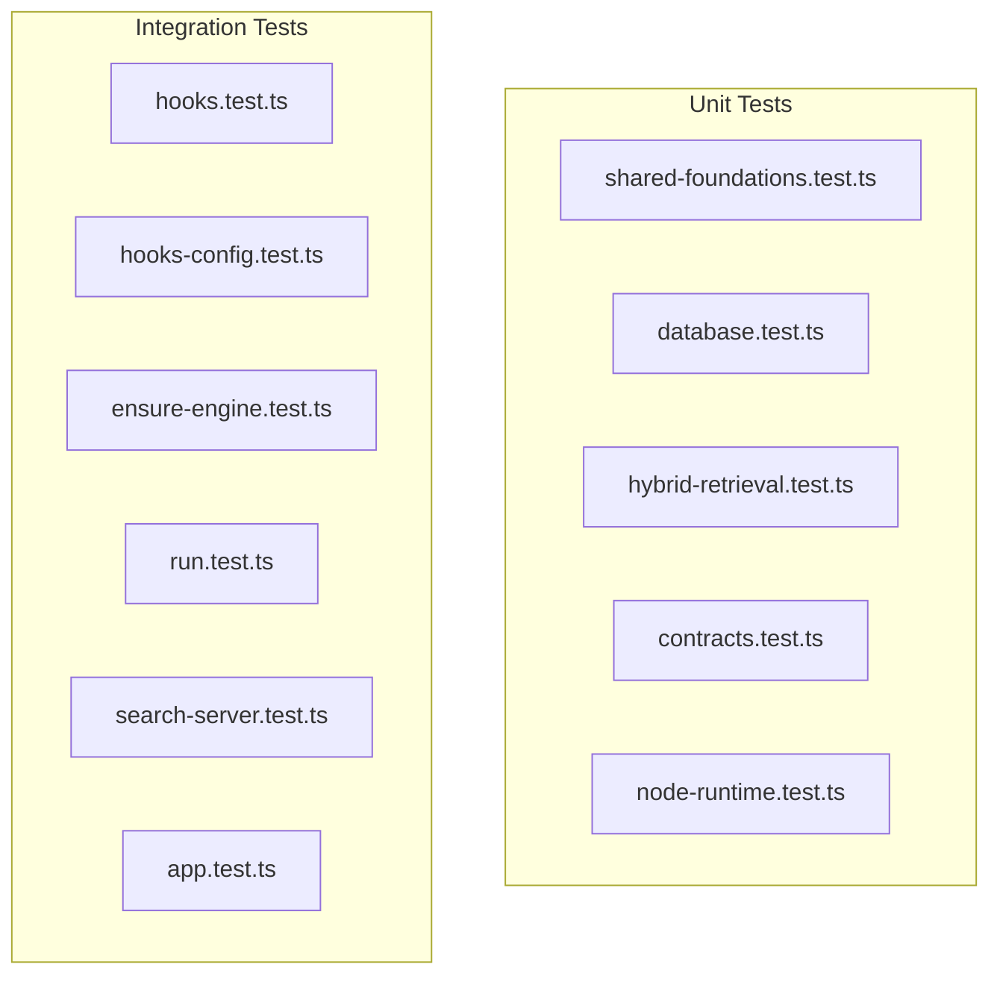

# Testing

All tests use **Vitest** with the `node` environment. Test files are colocated with source files using the `.test.ts` suffix.

## Test Configuration

- Config: `plugins/memories/vitest.config.ts`
- Includes: `src/**/*.test.ts`
- Run: `npm test` (delegates to workspace)

## Test Inventory

### Test Suites

| File | Suite | What It Tests |
|---|---|---|
| `shared/shared-foundations.test.ts` | shared foundations | Lockfile write/read/loopback guard, PID-gated removal, `normalizePathForMatch`, secret redaction, markdown formatting (grouping + debug mode) |
| `storage/database.test.ts` | MemoryStore | Transaction rollback on bad input, full CRUD round-trip with matchers and embeddings, schema CHECK constraint enforcement |
| `retrieval/hybrid-retrieval.test.ts` | RetrievalService | Path match ranking by policy effect + specificity, lexical+semantic RRF merge with dedup and score math, lexical-only fallback, token budget truncation |
| `extraction/contracts.test.ts` | extraction contracts | Valid worker payload + action schema parse, reject malformed update (empty updates object) |
| `extraction/run.test.ts` | extraction worker | Confidence threshold filtering (0.75), invalid JSON fail-safe with event logging, stop on first write failure, field-level validation error logging, `buildClaudeProcessEnv` injects `CLAUDE_CODE_SIMPLE=1`, extraction prompt text verification |
| `engine/ensure-engine.test.ts` | ensureEngine | Reuse healthy lock, clean stale lock (dead PID), reject non-loopback lock, fast-fail when spawned engine exits before health |
| `engine/node-runtime.test.ts` | node runtime selection | `parseNodeMajor` semver parsing, prefers required major (24), falls back to newest >= 24 |
| `hooks/hooks.test.ts` | hook handlers | SessionStart output (pinned memories XML), compact/resume sources, Ollama failure variants (3 codes, table-driven), engine failure messages, Node 24 missing guidance, Stop enqueue call, UserPromptSubmit memory-rules injection |
| `hooks/hooks-config.test.ts` | hooks.json templates | Every command in hooks.json matches `node "${CLAUDE_PLUGIN_ROOT}/dist/hooks/<name>.js"` (space-safe quoting) |
| `mcp/search-server.test.ts` | MCP recall server | Concise markdown output (default), verbose debug mode, invalid payload rejection, timeout on unreachable engine, invocation policy text verification |
| `api/app.test.ts` | createEngineApp | Health endpoint, full CRUD+search+logs integration, idle timeout callback, stats response shape, background hook lifecycle (start/heartbeat/finish blocks idle), stale hook expiry triggers idle + logs event |

### Test Patterns

**Dependency injection:** Both `executeWorker` and hook handlers accept optional `dependencies` objects for mocking:
- Extraction: `WorkerDependencies` with `appendEventLogFn`, `applyActionFn`, `readTranscriptContextFn`, `runClaudeFn`, `searchCandidatesFn`
- Hooks: injected `ensureEngine`, `resolveRepoId`, etc.

**In-process HTTP servers:** MCP and API tests spin up real HTTP servers (engine mock or the actual Express app) on ephemeral ports.

**Table-driven tests:** Ollama failure codes tested via `it.each` with three variants.

**Temp directories:** Tests use `mkdtemp` for isolation, cleaned up in `afterEach`.
