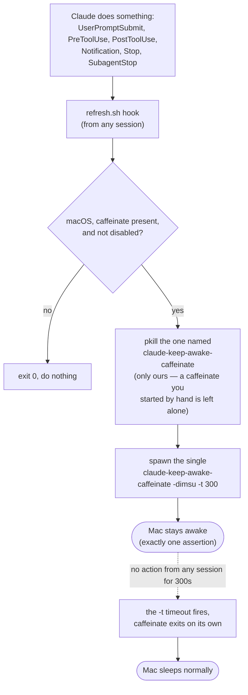

# keep-awake

Keeps your Mac from sleeping while Claude Code is actively working, and lets it
sleep normally once Claude goes idle. **macOS only.**



## How it works

It does **not** simulate key presses or mouse moves. It uses the built-in
`/usr/bin/caffeinate`, which creates IOKit power assertions — the supported,
invisible way to hold a Mac awake.

There is exactly **one** caffeinate for the whole machine, shared across every
Claude session — a singleton. On every Claude action (`UserPromptSubmit`,
`PreToolUse`, `PostToolUse`, `Notification`, `Stop`, `SubagentStop`), from
whichever session the hook fires, the plugin:

1. kills the existing Claude caffeinate, and
2. starts a fresh `caffeinate -dimsu -t <window>`.

So actions keep resetting a single assertion. When no session acts for
`<window>` seconds, that assertion self-expires and the Mac sleeps normally —
a **deadman switch** that self-heals and can never leak more than one window of
wakefulness.

### The Claude-specific name

The caffeinate is launched through a symlink named
**`claude-keep-awake-caffeinate`**, so it is identifiable in `ps` / `pmset` and
the plugin only ever kills *that* name (`pkill -f claude-keep-awake-caffeinate`).
A `caffeinate` you start by hand has a different name and is **never** touched.

To stop the plugin's caffeinate yourself: `pkill -f claude-keep-awake-caffeinate`.

### Known limitation

A single tool call longer than the window (e.g. a build over 5 minutes) has no
hook firing in the middle, so the Mac may drift toward sleep during that gap.
Raise `KEEP_AWAKE_WINDOW_SECONDS` if your tool calls routinely run longer.

## Configuration

| Variable | Default | Meaning |
| --- | --- | --- |
| `KEEP_AWAKE_FLAGS` | `dimsu` | `caffeinate` assertion flags, passed as `-<value>`. `d` display, `i` idle system, `m` disk, `s` system-on-AC, `u` user-active. Unknown letters are stripped. |
| `KEEP_AWAKE_WINDOW_SECONDS` | `300` | Deadman window — how long the Mac stays awake after the last action from any session. |
| `KEEP_AWAKE_DISABLE` | unset | Set to any non-empty value to make every hook a no-op. |

`-s` only takes effect on AC power; it is harmless on battery.

## Safety

- **macOS guard:** no-op when not running on Darwin or when `caffeinate` is absent.
- **Fail-open:** every hook exits `0` and never blocks a tool call.
- **Leak bound:** the assertion carries `-t <window>`, so the worst case is one
  window (default 5 min) of extra wakefulness after the last action.
- **Hand-run caffeinate is safe:** only the `claude-keep-awake-caffeinate` name
  is ever killed, never a plain `caffeinate` you launched yourself.

The singleton lives at `${TMPDIR}/claude-keep-awake/claude-keep-awake-caffeinate`
(a symlink to the real `caffeinate`). `TMPDIR` is per-user, so the singleton is
shared across all of your Claude sessions.

## Tests

```sh
sh test/run-tests.sh
```

No build step and no dependencies. The harness shims `caffeinate` and `uname`
onto `PATH` to observe behavior without touching real power assertions.
