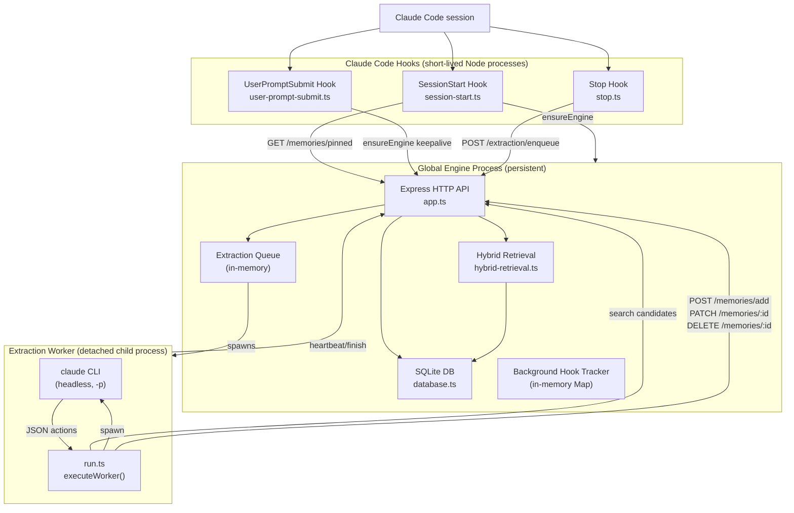

# Memories Plugin — Flow Documentation

This folder documents the major flows, logic, and architecture of the `memories` Claude plugin.

## Contents

| File | Description |
|---|---|
| [session-start-flow.md](./session-start-flow.md) | How `SessionStart` bootstraps the engine and injects pinned memories |
| [stop-hook-flow.md](./stop-hook-flow.md) | How `Stop` enqueues extraction and spawns the background worker |
| [extraction-flow.md](./extraction-flow.md) | End-to-end extraction: transcript → Claude → memory actions → DB |
| [engine-lifecycle.md](./engine-lifecycle.md) | Engine bootstrap, lock management, idle timeout, and shutdown |
| [api-routes.md](./api-routes.md) | Engine HTTP API surface with request/response contracts |
| [retrieval-flow.md](./retrieval-flow.md) | Hybrid search (semantic + lexical + path-match + RRF fusion) |
| [logging-systems.md](./logging-systems.md) | Two logging systems: ephemeral stderr vs. persistent event log |
| [background-hooks.md](./background-hooks.md) | Background hook lease, heartbeat, expiry, and sweep |

## High-Level System Diagram

