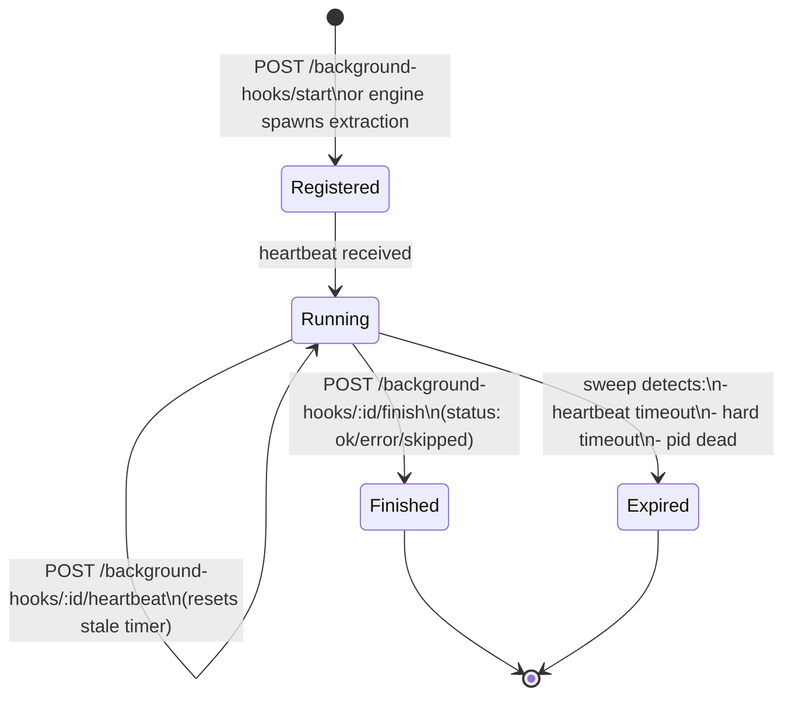
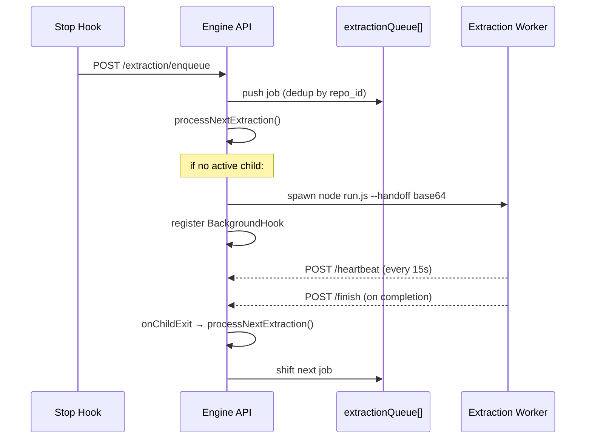

# Background Hooks

The engine tracks long-running background processes (currently: extraction workers) with a heartbeat-based lease system.

## Architecture



## Lease Lifecycle

### Registration (creation)

When the engine spawns an extraction worker, it creates a `BackgroundHookRecord` in memory:

```pseudocode
hook = {
  id: randomUUID()              // background_hook_id
  hook_name: 'extraction'
  startedAtMs: Date.now()
  lastHeartbeatAtMs: Date.now()
  staleAtMs: now + heartbeatTimeoutMs      // default: 60s
  hardTimeoutAtMs: now + maxRuntimeMs      // default: 10min
  session_id: job.session_id
  pid: child.pid
}
activeBackgroundHooks.set(hook.id, hook)
```

The `background_hook_id` is passed to the worker via the handoff payload, allowing it to report back.

### Heartbeat

The extraction worker sends heartbeats every `DEFAULT_BACKGROUND_HOOK_HEARTBEAT_INTERVAL_MS` (default: 15s).

```pseudocode
// In extraction worker (run.ts):
every 15s:
  POST /background-hooks/{background_hook_id}/heartbeat
  body: { pid: process.pid }

// Engine handler:
hook.lastHeartbeatAtMs = Date.now()
hook.staleAtMs = Date.now() + heartbeatTimeoutMs  // extend deadline
```

If a heartbeat fails (engine unreachable), the worker logs the error but continues running.

### Finish

When the worker completes (success or failure):

```pseudocode
// In extraction worker:
POST /background-hooks/{background_hook_id}/finish
body: { status: 'ok' | 'error' | 'skipped', detail: '...' }

// Engine handler:
hook = activeBackgroundHooks.get(id)
activeBackgroundHooks.delete(id)
appendEventLog(background-hook/finish, hook, status, detail)
```

### Expiry (Sweep)

A periodic timer runs every `sweepIntervalMs` (default: 15s) and removes stale hooks:

```pseudocode
sweepExpiredBackgroundHooks():
  now = Date.now()
  for hook in activeBackgroundHooks.values():
    if now >= hook.hardTimeoutAtMs:
      expired with reason: "exceeded max runtime of Xms"
    else if now >= hook.staleAtMs:
      expired with reason: "heartbeat timed out after Xms"
    else if typeof hook.pid === 'number' and not isPidAlive(hook.pid):
      expired with reason: "process {pid} is no longer alive"

  for each expired:
    activeBackgroundHooks.delete(hook.id)
    appendEventLog(background-hook/expire, hook, 'error', reason)
```

The sweep is also triggered on `GET /stats` and `GET /background-hooks` requests.

## Interaction with Idle Timeout

The idle timer **does not fire** while any background hook is active:

```pseudocode
checkIdleTimeout():
  if activeBackgroundHooks.size > 0:
    return  // busy — don't idle out
  if Date.now() - lastInteractionAtMs < idleTimeoutMs:
    return
  // trigger shutdown
```

This prevents the engine from shutting down mid-extraction.

## Extraction Queue Integration

The engine maintains a single active extraction child process and an in-memory queue:



**Deduplication:** If the same `repo_id` is enqueued twice before processing begins, the newer job replaces the older one in the queue (only the most recent transcript matters).

## Policy Defaults

| Policy | Default | Env Override |
|---|---|---|
| Heartbeat timeout | 60s | `backgroundHookPolicy.heartbeatTimeoutMs` |
| Max runtime (hard) | 10min | `backgroundHookPolicy.maxRuntimeMs` |
| Sweep interval | 15s | `backgroundHookPolicy.sweepIntervalMs` |
| Heartbeat send interval | 15s | `DEFAULT_BACKGROUND_HOOK_HEARTBEAT_INTERVAL_MS` |
