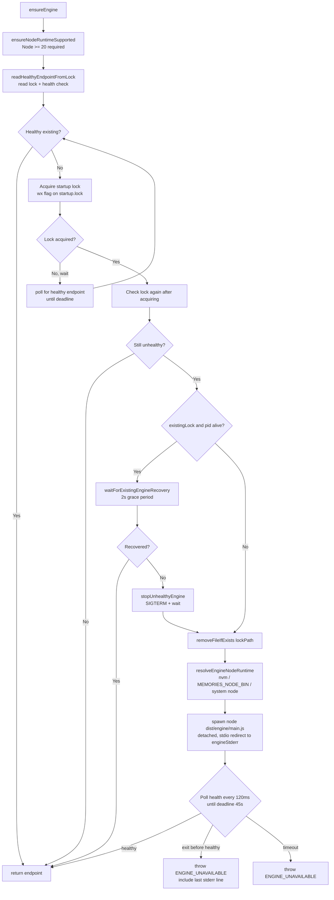

# Engine Lifecycle

The engine is a persistent Express HTTP server that runs as a background process. It owns the SQLite database, the extraction queue, and the background hook tracker.

Entry point: `src/engine/main.ts → bootstrap()`
Bootstrap helper: `src/engine/ensure-engine.ts → ensureEngine()`

## Engine Bootstrap (`main.ts`)

```mermaid
flowchart TD
    A[bootstrap] --> B[resolvePluginRoot\nCLAUDE_PLUGIN_ROOT or __dirname]
    B --> C[ensureGlobalDirectories\n~/.claude/memories/]
    C --> D[resolveSqliteVecPath\nvendor/sqlite-vec/darwin-arm64/vec0.dylib]
    D --> E[pickPort\nMEMORIES_ENGINE_PORT or OS-assigned]
    E --> F[createEngineApp\nExpress app + store + retrieval]
    F --> G[app.listen on 127.0.0.1:port]
    G --> H[writeLockMetadata\n~/.claude/memories/engine.lock\n{host, port, pid, started_at}]
    H --> I[Register SIGINT / SIGTERM handlers]
    I --> J{Running...}
    J -->|idle timeout| K[shutdown idle-timeout]
    J -->|POST /shutdown| L[shutdown api-request]
    J -->|SIGINT/SIGTERM| M[shutdown signal]
    K & L & M --> N[closeServer\nruntime.close\nremoveLockIfOwned\nprocess.exit 0]
```

## ensureEngine (`ensure-engine.ts`)

Called by hooks and workers to locate or start the engine. Returns `{ host, port }`.



## Lock Files

| File | Purpose |
|---|---|
| `~/.claude/memories/engine.lock` | Records `{ host, port, pid, started_at }` of running engine. Removed on shutdown. |
| `~/.claude/memories/engine-startup.lock` | Mutex to prevent concurrent startup races. Uses `wx` (exclusive create) flag. Removed after startup completes. |

## Idle Timeout

```pseudocode
every idleCheckIntervalMs (default 30s):
  if activeBackgroundHooks.size > 0: continue  // busy
  if Date.now() - lastInteractionAtMs < idleTimeoutMs (default 30min): continue
  idleShutdownTriggered = true
  onIdleTimeout()  // → shutdown('idle-timeout')
```

Any request except `GET /health` resets `lastInteractionAtMs`.

## Node Runtime Resolution

```pseudocode
resolveEngineNodeRuntime():
  if MEMORIES_NODE_BIN set:
    validate it's Node >= 20
    return it

  if nvm available:
    for version in [22, 20, 18]:  // descending
      if nvm has version installed:
        return it

  if system node >= 20:
    return it

  throw Error("Node 20+ is required for engine startup")
```

## Global Directories Created

```
~/.claude/memories/
  memories.db           // SQLite database
  engine.lock           // Running engine location
  engine-startup.lock   // Startup mutex
  engine-stderr.log     // Engine process stderr
  memory_events.log     // Persistent event log (JSONL)
```
