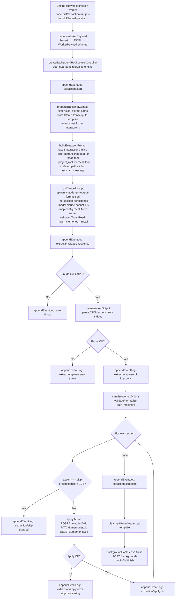

# Extraction Flow

After a session turn ends, the engine spawns a detached worker process that runs a headless Claude session to analyze the conversation transcript and decide what to memorize.

Entry point: `src/extraction/run.ts → executeWorker()`

## End-to-End Flow



## Transcript Filtering

```pseudocode
prepareTranscriptContext(transcriptPath, projectRoot, sessionId):
  raw = readFile(transcriptPath)
  lines = raw.split('\n').filter(Boolean)

  // Path extraction from last 300 raw lines (local-only, zero API cost)
  recentLines = lines[-300:]
  relatedPaths = Set()
  for line in recentLines:
    parsed = safeJsonParse(line)
    for value in collectPathValues(parsed):
      normalized = normalizeCandidatePath(value, projectRoot)
      if normalized: relatedPaths.add(normalized)

  // Filter all lines
  filteredLines = []
  for line in lines:
    parsed = safeJsonParse(line)
    if parsed.type in {'progress', 'file-history-snapshot', 'system'}: skip
    if parsed.isSidechain === true: skip
    filtered = filterContentBlocks(parsed)  // drop thinking, truncate tool_result/tool_use
    if filtered: filteredLines.push(JSON.stringify(filtered))

  // Extract last 3 user interactions
  last3 = extractLast3Interactions(filteredLines)

  // Write filtered transcript to temp file
  filteredPath = '{projectRoot}/.claude-memory/transcript-filtered-{sessionId}.jsonl'
  writeFile(filteredPath, filteredLines.join('\n'))

  return { filteredTranscriptPath: filteredPath, last3Interactions: last3, relatedPaths }
```

## Extraction Prompt Structure

```
You are a memory extraction agent. Analyze this conversation transcript and extract durable memories.
Return strict JSON only: {"actions":[...]}

## Available tools

1. Read tool — read the filtered transcript file for earlier context
   File path: {filteredTranscriptPath}
2. recall tool — search existing memories before creating/updating/deleting
   project_root: "{projectRoot}", include_debug_metadata: true

## Workflow
1. Read the last 3 interactions below
2. Identify candidate insights
3. Call recall tool to check for duplicates
4. Decide on actions
5. Read earlier transcript if needed
6. Output final JSON

## Extraction strategy, action contracts, pinning rules, safety rules
(same as before — see source for full text)

## Related paths: [list]
## Last assistant message: [text]
## Last 3 interactions: [filtered transcript lines]
```

## Action Application

| Action | API Call | Condition |
|---|---|---|
| `create` | `POST /memories/add` | confidence ≥ 0.75 |
| `update` | `PATCH /memories/:id` | confidence ≥ 0.75, targets existing memory_id |
| `delete` | `DELETE /memories/:id` | confidence ≥ 0.75, targets existing memory_id |
| `skip` | (no-op) | Always skipped |
| any | (skipped) | confidence < 0.75 |

First write failure stops processing remaining actions for that run.

## Path Matcher Sanitization

```pseudocode
sanitizePathMatchers(matchers, relatedPaths):
  disallowed = {'*', '**', '**/*', '/', './'}
  byBasename = Map(basename(p) → p for p in relatedPaths)
  seen = Set()
  result = []

  for matcher in matchers:
    raw = matcher.path_matcher.trim()
    normalized = normalizePathForMatch(raw)  // strip :L123 suffix, resolve
    if normalized in disallowed: continue
    if single-segment and basename in byBasename:
      normalized = byBasename[basename]  // resolve to full relative path
    if not duplicate:
      result.push(normalized)
    if result.length >= 12: break

  return result
```

## Worker Payload (base64-encoded)

```typescript
WorkerPayload = {
  endpoint: { host, port }   // engine address
  repo_id: string
  transcript_path: string
  project_root: string
  session_id?: string
  last_assistant_message?: string
  background_hook_id?: string  // for lease tracking
}
```
