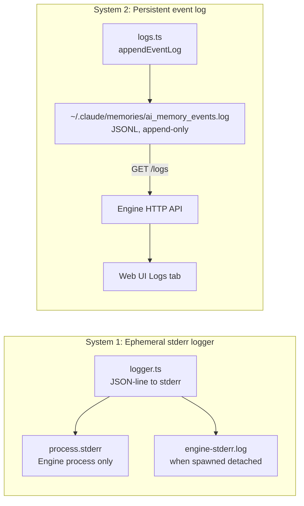

# Logging Systems

The plugin has two completely independent logging systems with different purposes, formats, and lifetimes.

## Overview



---

## System 1: Ephemeral Stderr Logger (`src/shared/logger.ts`)

**Purpose:** Debug/diagnostic output from the running engine process.  
**Format:** JSON lines on `process.stderr`.  
**Lifetime:** Ephemeral — lost when process exits (unless captured to `engine-stderr.log`).

### Log Levels

Controlled by `LOG_LEVEL` environment variable:

| Level | Numeric | Env value |
|---|---|---|
| debug | 0 | `debug` |
| info | 1 | `info` (default) |
| warn | 2 | `warn` |
| error | 3 | `error` |
| silent | 99 | `silent` |

### Usage

```typescript
logDebug('message', { key: 'value' })
logInfo('Engine started', { host: '127.0.0.1', port: 54321 })
logWarn('sqlite-vec binary not found', { expectedPath: '...' })
logError('Stop worker failed', { error: 'message' })
```

### Output Format

```json
{"level":"info","message":"Engine started","data":{"host":"127.0.0.1","port":54321}}
```

### Secret Redaction

Both systems apply the same pattern-based redaction before writing. Patterns include common secret-like keys (tokens, passwords, keys, secrets, credentials, etc.).

---

## System 2: Persistent Event Log (`src/shared/logs.ts`)

**Purpose:** Durable audit trail of all memory operations and hook lifecycle events.  
**Format:** Zod-validated JSONL, append-only.  
**Location:** `~/.claude/memories/ai_memory_events.log`  
**Retention:** Persists across engine restarts. Never automatically truncated.

### Event Schema (Zod-validated)

```typescript
EventLog = {
  at: ISO8601 string          // timestamp
  event: string               // event name
  kind: 'hook' | 'operation'  // source type
  status: 'ok' | 'error' | 'skipped'
  session_id?: string         // Claude session UUID
  memory_id?: string          // UUID of affected memory
  detail?: string             // human-readable description
  data?: Record<string, unknown>  // structured payload
}
```

### Event Taxonomy

| `event` | `kind` | Who emits it |
|---|---|---|
| `SessionStart` | `hook` | SessionStart hook |
| `Stop` | `hook` | Stop hook |
| `background-hook/start` | `hook` | Engine (when extraction starts) |
| `background-hook/finish` | `hook` | Engine (when extraction ends) |
| `background-hook/expire` | `hook` | Engine sweep (heartbeat timeout / hard timeout) |
| `extraction/start` | `operation` | Extraction worker |
| `extraction/context` | `operation` | Extraction worker |
| `extraction/claude-response` | `operation` | Extraction worker |
| `extraction/parse` | `operation` | Extraction worker |
| `extraction/skip` | `operation` | Extraction worker |
| `extraction/apply` | `operation` | Extraction worker |
| `extraction/complete` | `operation` | Extraction worker |
| `extraction/error` | `operation` | Extraction worker |
| `memory/search` | `operation` | Engine API |
| `memory/create` | `operation` | Engine API |
| `memory/update` | `operation` | Engine API |
| `memory/delete` | `operation` | Engine API |

### Log Nesting (hook_id)

Extraction worker logs include `data.hook_id` linking them to their parent background hook event.

```
background-hook/start  (kind=hook, data.hook_id="abc")
  extraction/start     (kind=operation, data.hook_id="abc")
  extraction/context   (kind=operation, data.hook_id="abc")
  extraction/claude-response  (kind=operation, data.hook_id="abc")
  extraction/parse     (kind=operation, data.hook_id="abc")
  extraction/apply     (kind=operation, data.hook_id="abc")  ×N
  extraction/complete  (kind=operation, data.hook_id="abc")
background-hook/finish (kind=hook, data.hook_id="abc")
```

The **Web UI Logs tab** renders these as an expandable tree: hook entries show a child-count badge, and expanding them reveals their nested operation logs.

### API

```
GET /logs?limit=200&order=desc
→ { logs: EventLog[], total: number }
```

Default: 200 most recent, descending (newest first). Max: 1000.

### `appendEventLog` Implementation

```pseudocode
appendEventLog(logPath, entry):
  validated = memoryEventLogSchema.parse(entry)   // Zod validation
  redacted = redactSecrets(validated)             // pattern-based
  line = JSON.stringify(redacted) + '\n'
  await fs.appendFile(logPath, line, 'utf8')
```

### `readEventLogs` Implementation

```pseudocode
readEventLogs(logPath, limit, order):
  raw = await fs.readFile(logPath)
  lines = raw.split('\n').filter(Boolean)
  parsed = lines.flatMap(line => {
    try: return [JSON.parse(line)]
    catch: return []
  })
  if order === 'desc': parsed.reverse()
  return parsed.slice(0, limit)
```
