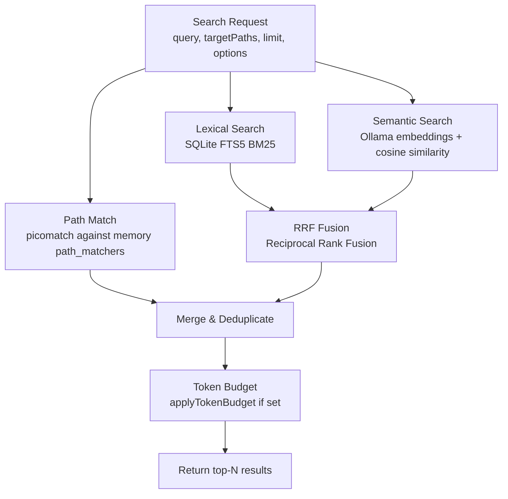

# Hybrid Retrieval Flow

Memory search uses three independent retrieval strategies that are merged and ranked.
Entry point: `src/retrieval/hybrid-retrieval.ts → RetrievalService.search()`

## Architecture Overview



## Result Priority

Results are returned in this order:
1. **Path matches** first (high priority — file-scoped rules are most contextually relevant)
2. **Hybrid RRF results** (lexical + semantic fusion) fill remaining slots

```pseudocode
merged = []
seen = Set()

for result in pathMatches:
  if not seen(result.id):
    merged.push(result)
    seen.add(result.id)
  if merged.length >= limit: return merged

for result in hybridRrf:
  if not seen(result.id):
    merged.push(result)
    seen.add(result.id)
  if merged.length >= limit: break

return applyTokenBudget(merged, responseTokenBudget)[:limit]
```

## Path Match

Matches memories whose `path_matchers` glob patterns match any of the `targetPaths`.

```pseudocode
findPathMatches(repoId, targetPaths, memoryTypes, includePinned):
  normalizedTargets = targetPaths.map(normalizePathForMatch)

  bestMatchByMemoryId = Map()
  for matcher in store.listPathMatchers(repoId):
    if picomatch(matcher.path_matcher, {dot:true}).matches(any normalizedTarget):
      specificity = computeMatcherSpecificity(matcher.path_matcher)
      bestMatchByMemoryId.set(matcher.memory_id, most_specific)

  memories = store.getMemoriesByIds(repoId, [...bestMatchByMemoryId.keys()])
  ranked = memories.map(m => {
    specificity = bestMatchByMemoryId[m.id]
    effectRank = classifyPolicyEffect(m)  // deny > must > preference > context
    return { memory, specificity, effectRank }
  })

  ranked.sort(sortPathMatches)
  // sort: deny first, then must, then more-specific matchers, then more recent

  return ranked.map((entry, index) => ({
    ...entry.memory,
    score: 1 / (index + 1),
    matched_by: ['path'],
    path_score: 1 / (index + 1)
  }))
```

### Matcher Specificity Ranking

More specific matchers win ties:
1. `exact-file` (`src/hooks/stop.ts`) — exact dot-containing filename
2. `exact-dir` (`src/hooks`) — directory without glob
3. `single-glob` (`src/hooks/*.ts`) — shallow glob
4. `deep-glob` (`src/**/*.ts`) — recursive glob

Within same specificity: more literal segments > fewer wildcard segments > longer pattern.

### Policy Effect Ranking (within path matches)

Memories with stronger policy rules appear first:
- `deny` (do not / never / must not / forbidden)
- `must` (must / always / required / enforce)  
- `preference` (prefer / should / recommended)
- `context` (everything else, including non-rules)

## Lexical Search (FTS5 BM25)

```pseudocode
lexicalSearch(repoId, { query, limit, includePinned, memoryTypes }):
  // SQLite FTS5 full-text index on memory content + tags
  // BM25 ranking built into SQLite
  rows = db.prepare(`
    SELECT memory_id, bm25(memories_fts) as score
    FROM memories_fts
    WHERE memories_fts MATCH ?
    AND repo_id = ?
    ORDER BY score
    LIMIT ?
  `).all(sanitizeQuery(query), repoId, limit)

  return rows.map(row => ({
    ...store.getMemory(repoId, row.memory_id),
    score: normalized_bm25_score,
    matched_by: ['lexical'],
    lexical_score: normalized_bm25_score
  }))
```

## Semantic Search (Cosine Similarity)

```pseudocode
semanticSearch(repoId, { query, semanticK, includePinned, memoryTypes }):
  if not embeddingClient.isConfigured(): return []

  queryVector = await embeddingClient.embed(query)
  if not queryVector: return []

  rows = store.listEmbeddings(repoId, memoryTypes, includePinned)

  scored = rows
    .filter(row => row.vector.length === queryVector.length)
    .map(row => {
      cosine = dot(queryVector, row.vector) / (|queryVector| * |row.vector|)
      normalizedScore = (cosine + 1) / 2  // map [-1,1] → [0,1]
      return { ...row, score: normalizedScore, matched_by: ['semantic'] }
    })
    .sort(descending by score)
    .slice(0, semanticK)

  return scored
```

## Reciprocal Rank Fusion (RRF)

Combines lexical and semantic result lists using RRF with constant k=60.

```pseudocode
mergeHybrid(lexical, semantic, limit):
  byMemoryId = Map()

  addRankedBranch(branch, branchName):
    for i, result in enumerate(branch):
      rank = i + 1
      contribution = 1 / (60 + rank)    // RRF formula
      entry = byMemoryId.get(result.id)
      if not entry:
        byMemoryId.set(result.id, {
          representative: result,
          bestRank: rank,
          rrfScore: contribution,
          matchedBy: {branchName},
          lexicalScore: ...,
          semanticScore: ...
        })
      else:
        entry.rrfScore += contribution    // accumulate contributions
        entry.matchedBy.add(branchName)

  addRankedBranch(lexical, 'lexical')
  addRankedBranch(semantic, 'semantic')

  maxRrfScore = max(entry.rrfScore for entry in byMemoryId.values())

  return byMemoryId.values()
    .map(entry => ({
      ...entry.representative,
      score: entry.rrfScore / maxRrfScore,  // normalize to [0,1]
      matched_by: ['path', 'lexical', 'semantic'].filter(s in entry.matchedBy),
      rrf_score: entry.rrfScore
    }))
    .sort(descending by score)
    .slice(0, limit)
```

Results matching **both** lexical and semantic get a higher RRF score due to accumulated contributions.

## Token Budget

If `responseTokenBudget` is set, results are trimmed to fit within an estimated token count:

```pseudocode
applyTokenBudget(results, budget):
  estimate(text) = text.length / 4    // rough: 4 chars per token
  remaining = budget
  output = []
  for result in results:
    cost = estimate(result.content)
    if remaining - cost < 0: break
    output.push(result)
    remaining -= cost
  return output
```

## Embedding Client

`src/retrieval/embeddings.ts` — Ollama HTTP client

```pseudocode
embed(text):
  POST {MEMORIES_OLLAMA_URL}/api/embeddings
  body: { model: profile.model, prompt: text }
  timeout: MEMORIES_OLLAMA_TIMEOUT_MS (default 5000ms)
  returns: number[]  // embedding vector

isConfigured():
  return MEMORIES_OLLAMA_URL is set  // always true if using defaults
```

Supported models (via `MEMORIES_OLLAMA_PROFILE`):
| Profile | Model | Dimensions |
|---|---|---|
| `default` | `nomic-embed-text` | 768 |
| `mxbai` | `mxbai-embed-large` | 1024 |
