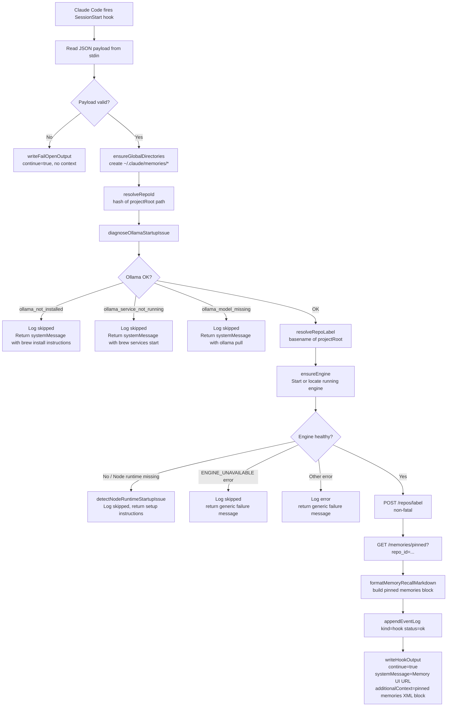

# SessionStart Flow

Triggered automatically by Claude Code when a new session begins.
Entry point: `src/hooks/session-start.ts → run()`

## Flow Diagram



## Ollama Diagnosis

```pseudocode
diagnoseOllamaStartupIssue():
  profile = resolveOllamaProfile(MEMORIES_OLLAMA_PROFILE)
  model = OLLAMA_PROFILE_CONFIG[profile].model
  baseUrl = MEMORIES_OLLAMA_URL ?? "http://localhost:11434"

  if not isOllamaInstalled():
    return issue(ollama_not_installed)

  try:
    modelNames = fetchOllamaModelNames(baseUrl, timeout=min(configuredTimeout, 2500ms))
  catch OllamaServiceNotRunningError:
    return issue(ollama_service_not_running)

  if not hasOllamaModel(modelNames, model):
    return issue(ollama_model_missing)

  return null  // all good
```

## Session Context Injection

The hook returns `additionalContext` in this structure:

```xml
<memory>
  <guidance>
    The `recall` tool is your main memory brain for this project.
    REQUIRED: call `recall` before acting. Do not skip.
    ...
  </guidance>
  <pinned_memories>
    ## Memories
    ### [rule] ...
    ### [fact] ...
  </pinned_memories>
</memory>
```

## Key Environment Variables

| Variable | Default | Purpose |
|---|---|---|
| `MEMORIES_OLLAMA_PROFILE` | `default` | Selects Ollama model + embedding dimensions |
| `MEMORIES_OLLAMA_URL` | `http://localhost:11434` | Ollama base URL |
| `MEMORIES_OLLAMA_TIMEOUT_MS` | 5000 | Max wait for Ollama, capped at 2500ms for SessionStart |
| `MEMORIES_NODE_BIN` | (auto-detected) | Override Node binary for engine startup |

## Fail-Open Guarantee

All error branches return `{ continue: true }` — the hook never blocks Claude from starting.
