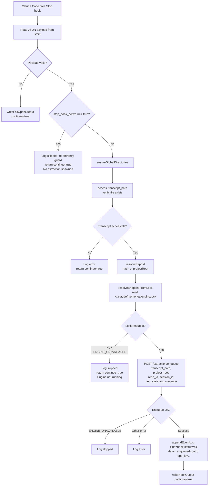

# Stop Hook Flow

Triggered automatically by Claude Code at the end of each assistant turn (before Claude yields).
Entry point: `src/hooks/stop.ts → run()`

## Flow Diagram



## Re-entrancy Guard

The `stop_hook_active` flag prevents infinite loops.
When the extraction worker (a Claude subprocess) completes a turn, Claude fires Stop again.
Without the guard, that would trigger another extraction, which would spawn another Claude, and so on.

```pseudocode
if payload.stop_hook_active === true:
  log(skipped, "stop_hook_active=true")
  return { continue: true }
  // extraction does NOT run
```

## Enqueue vs. Execute

The Stop hook does **not** run extraction inline — it only enqueues.
The engine (`app.ts`) owns a queue and a single active extraction child process.

```pseudocode
POST /extraction/enqueue:
  job = { transcript_path, project_root, repo_id, session_id, last_assistant_message }
  extractionQueue.push(job)
  if no active extraction running:
    drainExtractionQueue()  // spawns worker immediately
```

## Key Fields in Payload

| Field | Type | Purpose |
|---|---|---|
| `transcript_path` | string | Absolute path to the JSONL conversation transcript |
| `stop_hook_active` | boolean | Re-entrancy guard — skip extraction if true |
| `session_id` | string? | Propagated to event log for correlation |
| `last_assistant_message` | string? | Used as the candidate search query for extraction |
